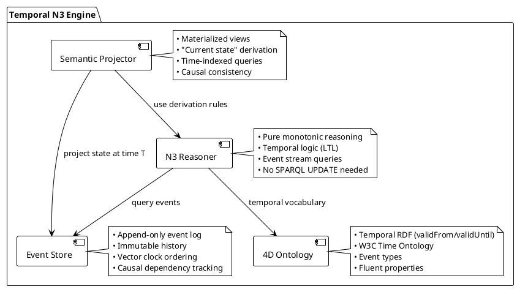
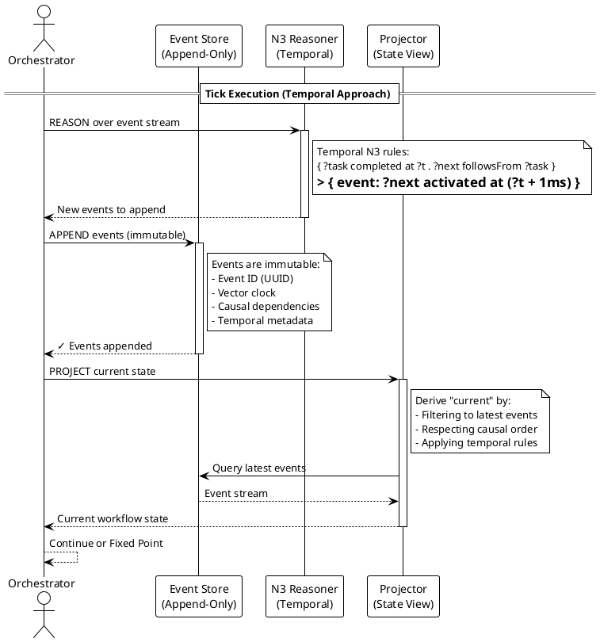

# ADR-002: Exploratory Analysis - Temporal N3 as Alternative to Hybrid Architecture

**Status**: Exploratory (Not Implemented)
**Date**: 2025-01-28
**Deciders**: KGCL Research Team
**Technical Story**: Explore whether time-aware N3 reasoning eliminates need for SPARQL mutations
**Challenges**: ADR-001 (Hybrid Engine Architecture)

---

## Philosophical Premise

### The Question

**ADR-001** identifies monotonicity as a fundamental barrier requiring a hybrid architecture (N3 + SPARQL + PyOxigraph). But what if **monotonicity isn't a bug, it's a feature**?

**Observation**: Physical reality is also monotonic:
- Time only flows forward (thermodynamic arrow of time)
- Events cannot be un-occurred (causality is irreversible)
- The past is immutable (we can only add to history)
- State changes are actually event sequences (physics is additive)

**Question**: If we model workflows as **temporal event streams** rather than **mutable state**, does N3's monotonicity become an asset instead of a limitation?

### The Insight

What we call "state transition" (`Pending → Active → Completed`) is actually:
1. Event at T=0: `task became Pending`
2. Event at T=1: `task became Active`
3. Event at T=2: `task became Completed`

**Current approach** (ADR-001):
- Stores only current state (mutable)
- Uses SPARQL DELETE to simulate "forgetting"
- Requires complex coordination (7 steps)

**Temporal approach** (this ADR):
- Stores complete event history (immutable)
- Queries "current state" by filtering to latest events
- N3 reasoning works directly on event streams

**Analogy**: Git doesn't delete commits, it adds new ones. The "current state" is HEAD, but full history exists.

---

## Context and Problem Statement

### What ADR-001 Solved

The hybrid architecture overcomes 5 "impossible operations":

| Operation | ADR-001 Solution | Temporal Alternative? |
|-----------|------------------|----------------------|
| Status Transition | SPARQL DELETE old, INSERT new | Event: `task transitioned to X at T` |
| Counter Decrement | SPARQL UPDATE counter | Event: `instance completed at T` → derive count |
| Marker Cleanup | SPARQL DELETE marker | Event: `marker became irrelevant at T` |
| Loop Reset | SPARQL DELETE completed | Event: `loop iteration N started at T` |
| Token Cancellation | SPARQL DELETE tokens | Event: `token cancelled at T` |

### What If Time Is First-Class?

Instead of:
```turtle
# Mutable state (requires SPARQL DELETE)
?task kgc:status "Pending" .   # T=0
?task kgc:status "Active" .    # T=1 ERROR: contradiction
```

Use:
```turtle
# Immutable events (monotonic, no contradiction)
?event1 a kgc:StatusChangeEvent ;
        kgc:subject ?task ;
        kgc:toStatus "Pending" ;
        kgc:occurredAt "2025-01-28T10:00:00Z"^^xsd:dateTime ;
        kgc:vectorClock [1, 0, 0] .

?event2 a kgc:StatusChangeEvent ;
        kgc:subject ?task ;
        kgc:toStatus "Active" ;
        kgc:occurredAt "2025-01-28T10:00:05Z"^^xsd:dateTime ;
        kgc:vectorClock [1, 1, 0] ;
        kgc:causedBy ?event1 .

?event3 a kgc:StatusChangeEvent ;
        kgc:subject ?task ;
        kgc:toStatus "Completed" ;
        kgc:occurredAt "2025-01-28T10:00:10Z"^^xsd:dateTime ;
        kgc:vectorClock [1, 1, 1] ;
        kgc:causedBy ?event2 .
```

**Query current status** (pure N3, no SPARQL DELETE):
```turtle
# Derive current status from latest event
{
    ?task a yawl:Task .
    ?event kgc:subject ?task ;
           kgc:toStatus ?status ;
           kgc:occurredAt ?time .

    # No later event exists for this task
    _:scope log:notIncludes {
        ?laterEvent kgc:subject ?task ;
                    kgc:occurredAt ?laterTime .
        ?laterTime math:greaterThan ?time .
    } .
}
=>
{
    ?task kgc:currentStatus ?status .
} .
```

---

## Temporal N3 Architecture

### Component Diagram



### Execution Flow



---

## Implementation Examples

### Example 1: WCP-1 Sequence (Temporal Event Model)

**Temporal N3 Rule** (no SPARQL needed):

```turtle
@prefix kgc: <urn:kgc:> .
@prefix time: <http://www.w3.org/2006/time#> .
@prefix log: <http://www.w3.org/2000/10/swap/log#> .
@prefix math: <http://www.w3.org/2000/10/swap/math#> .

# =============================================================================
# WCP-1: SEQUENCE (Temporal Event Model)
# =============================================================================
# When task completes, emit event for next task activation

{
    # Find task completion event
    ?completionEvent a kgc:TaskCompletedEvent ;
                     kgc:task ?task ;
                     kgc:occurredAt ?completionTime ;
                     kgc:vectorClock ?vc .

    # Task has outgoing flow
    ?task yawl:flowsInto ?flow .
    ?flow yawl:nextElementRef ?nextTask .

    # No activation event already exists for next task after completion
    _:scope log:notIncludes {
        ?existingEvent a kgc:TaskActivatedEvent ;
                       kgc:task ?nextTask ;
                       kgc:causedBy ?completionEvent .
    } .
}
=>
{
    # Emit new activation event (monotonic addition)
    _:activationEvent a kgc:TaskActivatedEvent ;
                      kgc:task ?nextTask ;
                      kgc:occurredAt ?activationTime ;  # Now + 1ms
                      kgc:vectorClock ?newVC ;          # Increment VC
                      kgc:causedBy ?completionEvent .   # Causal link

    # Metadata (derived)
    (?completionTime 1) math:sum ?activationTime .
    (?vc 1) math:sum ?newVC .
} .
```

**Query Current Status** (pure N3 derivation):

```turtle
# Derive current status from event history
{
    ?task a yawl:Task .

    # Find latest status change event
    ?event a kgc:StatusChangeEvent ;
           kgc:task ?task ;
           kgc:toStatus ?status ;
           kgc:occurredAt ?time .

    # No later event exists
    _:scope log:notIncludes {
        ?laterEvent a kgc:StatusChangeEvent ;
                    kgc:task ?task ;
                    kgc:occurredAt ?laterTime .
        ?laterTime math:greaterThan ?time .
    } .
}
=>
{
    ?task kgc:currentStatus ?status .
    ?task kgc:statusAsOf ?time .
} .
```

**No SPARQL DELETE needed** - history is immutable, "current" is derived.

### Example 2: WCP-4 XOR-Split (Temporal First-Wins)

**Temporal N3 Rule**:

```turtle
# =============================================================================
# WCP-4: XOR-SPLIT (Temporal First-Wins)
# =============================================================================
# First true predicate wins - naturally enforced by temporal ordering

{
    # Task completion event
    ?completionEvent a kgc:TaskCompletedEvent ;
                     kgc:task ?task ;
                     kgc:occurredAt ?completionTime ;
                     kgc:vectorClock ?vc .

    # Task has XOR-split
    ?task yawl:hasSplit yawl:ControlTypeXor .

    # Find first true predicate (lowest ordering)
    ?task yawl:flowsInto ?flow .
    ?flow yawl:hasPredicate ?pred ;
          yawl:nextElementRef ?nextTask .
    ?pred kgc:evaluatesTo true ;
          yawl:ordering ?order .

    # No predicate with lower ordering is true
    _:scope log:notIncludes {
        ?task yawl:flowsInto ?otherFlow .
        ?otherFlow yawl:hasPredicate ?otherPred .
        ?otherPred kgc:evaluatesTo true ;
                   yawl:ordering ?otherOrder .
        ?otherOrder math:lessThan ?order .
    } .

    # No branch selection event already emitted
    _:scope2 log:notIncludes {
        ?selectionEvent a kgc:XorBranchSelectedEvent ;
                        kgc:task ?task ;
                        kgc:causedBy ?completionEvent .
    } .
}
=>
{
    # Emit branch selection event (immutable marker)
    _:selectionEvent a kgc:XorBranchSelectedEvent ;
                     kgc:task ?task ;
                     kgc:selectedBranch ?nextTask ;
                     kgc:selectedPredicate ?pred ;
                     kgc:occurredAt ?selectionTime ;
                     kgc:vectorClock ?newVC ;
                     kgc:causedBy ?completionEvent .

    # Activation event for selected branch
    _:activationEvent a kgc:TaskActivatedEvent ;
                      kgc:task ?nextTask ;
                      kgc:occurredAt ?activationTime ;
                      kgc:vectorClock ?newVC2 ;
                      kgc:causedBy ?selectionEvent .

    (?completionTime 1) math:sum ?selectionTime .
    (?selectionTime 1) math:sum ?activationTime .
    (?vc 1) math:sum ?newVC .
    (?newVC 1) math:sum ?newVC2 .
} .
```

**Key Insight**: The "first-wins marker" (`xorBranchSelected`) becomes an **immutable event** instead of a **mutable flag**. The guard `_:scope2 log:notIncludes` prevents duplicate selection events - monotonically safe.

### Example 3: WCP-14 Multi-Instance (Event-Based Counter)

**Temporal N3 Rule**:

```turtle
# =============================================================================
# WCP-14: MULTI-INSTANCE (Event-Based Counting)
# =============================================================================
# Counter is DERIVED from event count, not stored mutably

{
    # MI task activated
    ?miActivation a kgc:MITaskActivatedEvent ;
                  kgc:task ?miTask ;
                  kgc:instanceCount ?n .

    # Count completed instances (query events)
    ?miTask a yawl:MultiInstanceTask .

    # Derive count by counting completion events
    {
        SELECT (COUNT(?instance) AS ?completedCount)
        WHERE {
            ?completionEvent a kgc:InstanceCompletedEvent ;
                             kgc:parentMI ?miTask .
        }
    } .

    # Threshold met
    ?completedCount math:notLessThan ?n .

    # No MI completion event already emitted
    _:scope log:notIncludes {
        ?miCompletion a kgc:MITaskCompletedEvent ;
                      kgc:task ?miTask .
    } .
}
=>
{
    # Emit MI completion event
    _:completion a kgc:MITaskCompletedEvent ;
                 kgc:task ?miTask ;
                 kgc:occurredAt ?now ;
                 kgc:completedInstances ?completedCount ;
                 kgc:vectorClock ?vc .
} .
```

**Key Insight**: Counter decrements are DERIVED by counting events, not stored as mutable state. The count is always computed from immutable history.

---

## Temporal Logic Integration

### Linear Temporal Logic (LTL) in N3

**Temporal operators** for workflow properties:

```turtle
# =============================================================================
# LTL OPERATORS (Temporal N3 Extension)
# =============================================================================

# ALWAYS φ: φ holds at all time points
{
    ?formula a kgc:AlwaysFormula ;
             kgc:innerFormula ?phi .

    # Check φ at every event
    _:scope log:notIncludes {
        ?event a kgc:Event ;
               kgc:occurredAt ?time .
        # Evaluate φ at time, get False
        ?phi kgc:evaluatedAt ?time ;
             kgc:result false .
    } .
}
=>
{
    ?formula kgc:satisfied true .
} .

# EVENTUALLY φ: φ holds at some future time
{
    ?formula a kgc:EventuallyFormula ;
             kgc:innerFormula ?phi .

    # Find at least one event where φ is true
    ?event a kgc:Event ;
           kgc:occurredAt ?time .
    ?phi kgc:evaluatedAt ?time ;
         kgc:result true .
}
=>
{
    ?formula kgc:satisfied true .
} .

# UNTIL φ U ψ: φ holds until ψ becomes true
{
    ?formula a kgc:UntilFormula ;
             kgc:leftFormula ?phi ;
             kgc:rightFormula ?psi .

    # Find time when ψ becomes true
    ?psiEvent a kgc:Event ;
              kgc:occurredAt ?psiTime .
    ?psi kgc:evaluatedAt ?psiTime ;
         kgc:result true .

    # Check φ holds at all prior times
    _:scope log:notIncludes {
        ?priorEvent a kgc:Event ;
                    kgc:occurredAt ?priorTime .
        ?priorTime math:lessThan ?psiTime .
        ?phi kgc:evaluatedAt ?priorTime ;
             kgc:result false .
    } .
}
=>
{
    ?formula kgc:satisfied true .
} .
```

### Workflow Invariants

**Express complex temporal properties**:

```turtle
# Invariant: Task never transitions from Completed to Active
{
    ?invariant a kgc:WorkflowInvariant ;
               kgc:formula [
                   a kgc:AlwaysFormula ;
                   kgc:innerFormula [
                       a kgc:ImplicationFormula ;
                       kgc:antecedent [
                           a kgc:StatusFormula ;
                           kgc:task ?task ;
                           kgc:status "Completed"
                       ] ;
                       kgc:consequent [
                           a kgc:NotFormula ;
                           kgc:innerFormula [
                               a kgc:EventuallyFormula ;
                               kgc:innerFormula [
                                   a kgc:StatusFormula ;
                                   kgc:task ?task ;
                                   kgc:status "Active"
                               ]
                           ]
                       ]
                   ]
               ] .
}
=>
{
    # Validate: completed tasks never reactivate
    ?invariant kgc:validated true .
} .
```

---

## 4D Ontology: Fluents and Temporal Slices

### Perdurantist View (4D Ontology)

**Philosophy**: Objects are 4D spacetime worms, not 3D objects that change.

```turtle
# =============================================================================
# 4D ONTOLOGY: TEMPORAL PARTS
# =============================================================================

# Task is a temporal continuant with time slices
?task a kgc:TemporalContinuant ;
      kgc:hasTemporalPart ?taskSliceT0 ;
      kgc:hasTemporalPart ?taskSliceT1 ;
      kgc:hasTemporalPart ?taskSliceT2 .

# Each slice exists at a time with properties
?taskSliceT0 a kgc:TemporalPart ;
             kgc:validFrom "2025-01-28T10:00:00Z"^^xsd:dateTime ;
             kgc:validUntil "2025-01-28T10:00:05Z"^^xsd:dateTime ;
             kgc:status "Pending" .

?taskSliceT1 a kgc:TemporalPart ;
             kgc:validFrom "2025-01-28T10:00:05Z"^^xsd:dateTime ;
             kgc:validUntil "2025-01-28T10:00:10Z"^^xsd:dateTime ;
             kgc:status "Active" .

?taskSliceT2 a kgc:TemporalPart ;
             kgc:validFrom "2025-01-28T10:00:10Z"^^xsd:dateTime ;
             kgc:validUntil time:Infinity ;
             kgc:status "Completed" .

# Query status at time T (pure N3, no DELETE)
{
    ?task kgc:hasTemporalPart ?slice .
    ?slice kgc:validFrom ?from ;
           kgc:validUntil ?until ;
           kgc:status ?status .

    "2025-01-28T10:00:07Z"^^xsd:dateTime math:notLessThan ?from .
    "2025-01-28T10:00:07Z"^^xsd:dateTime math:lessThan ?until .
}
=>
{
    ?task kgc:statusAt "2025-01-28T10:00:07Z"^^xsd:dateTime ;
          kgc:hasStatus "Active" .
} .
```

**Advantage**: No contradiction - each slice has ONE status valid for ONE time range.

---

## Time-Travel Debugging

### Reconstruct State at Any Time

```turtle
# =============================================================================
# TIME-TRAVEL: STATE AT TIME T
# =============================================================================

# Given: Event log up to time T
# Reconstruct workflow state as of T

{
    ?query a kgc:TimePointQuery ;
           kgc:atTime ?queryTime .

    # Find all events before query time
    ?event a kgc:Event ;
           kgc:occurredAt ?eventTime .
    ?eventTime math:notGreaterThan ?queryTime .

    # Apply events in causal order (vector clock)
    # ... (complex ordering logic) ...
}
=>
{
    ?query kgc:resultState ?reconstructedState .
} .
```

### Causal Consistency

**Vector clocks ensure causal ordering**:

```turtle
# Event E1 happened-before E2 if VC(E1) < VC(E2)
{
    ?e1 kgc:vectorClock ?vc1 .
    ?e2 kgc:vectorClock ?vc2 .

    # VC(E1) < VC(E2) iff for all i: VC1[i] <= VC2[i] and exists j: VC1[j] < VC2[j]
    # ... (vector comparison logic) ...
}
=>
{
    ?e1 kgc:happenedBefore ?e2 .
} .

# Concurrent events: neither happened-before the other
{
    ?e1 a kgc:Event .
    ?e2 a kgc:Event .

    _:scope log:notIncludes { ?e1 kgc:happenedBefore ?e2 } .
    _:scope2 log:notIncludes { ?e2 kgc:happenedBefore ?e1 } .
}
=>
{
    ?e1 kgc:concurrent ?e2 .
} .
```

---

## Comparison: Hybrid vs Temporal

### Architecture Complexity

| Aspect | Hybrid (ADR-001) | Temporal N3 (This ADR) |
|--------|------------------|------------------------|
| **Components** | 5 (Python, PyOxigraph, EYE, SPARQL, SHACL) | 3 (Python, Event Store, N3) |
| **Languages** | 3 (Python, N3, SPARQL) | 2 (Python, N3) |
| **Execution Steps** | 7 (BEGIN → INFERENCE → MUTATION → VALIDATE → COMMIT) | 3 (REASON → APPEND → PROJECT) |
| **Reasoning Paradigm** | Hybrid (monotonic + non-monotonic) | Pure monotonic |
| **State Model** | Mutable (DELETE + INSERT) | Immutable (append-only) |

### Performance

| Operation | Hybrid | Temporal |
|-----------|--------|----------|
| **Tick Execution** | Sub-100ms (measured) | Unknown (depends on event count) |
| **State Query** | O(1) - direct lookup | O(E) - scan events, E = event count |
| **History Query** | Not supported (history deleted) | O(E) - native event stream |
| **Storage** | O(N) - current state only, N = nodes | O(E) - complete history, E >> N |
| **Compaction** | Not needed (DELETE removes old data) | Required (event log grows unbounded) |

### Expressiveness

| Capability | Hybrid | Temporal |
|------------|--------|----------|
| **Current State** | ✅ Efficient (O(1) lookup) | ⚠️ Derived (O(E) scan) |
| **Historical Query** | ❌ Not supported (DELETED) | ✅ Native (full history) |
| **Time-Travel Debug** | ❌ Not possible | ✅ Reconstruct any time point |
| **Causal Reasoning** | ⚠️ Implicit (rule order) | ✅ Explicit (vector clocks) |
| **Temporal Logic** | ❌ Not supported | ✅ LTL operators native |
| **Audit Trail** | ⚠️ Requires separate log | ✅ Event log IS audit trail |
| **Distributed Consistency** | ⚠️ Single-node (PyOxigraph) | ✅ Causal consistency (vector clocks) |

---

## Trade-offs

### Advantages of Temporal N3

1. **Pure Monotonic Reasoning**:
   - No SPARQL DELETE needed (conceptually simpler)
   - N3 can express all workflow patterns (no impedance mismatch)
   - Formal semantics preserved (events are facts)

2. **Complete History**:
   - Audit trail is native (every event recorded)
   - Time-travel debugging (reconstruct state at any time)
   - Compliance requirements met automatically

3. **Causal Consistency**:
   - Vector clocks ensure distributed correctness
   - Happened-before relationships explicit
   - Concurrent events detected

4. **Temporal Reasoning**:
   - LTL operators for invariant checking
   - Query state at any time point
   - Express temporal properties declaratively

5. **Simpler Architecture**:
   - 3 components vs 5 (no SPARQL mutator, no complex coordination)
   - 2 languages vs 3 (no SPARQL UPDATE)
   - Append-only simplifies concurrency (no DELETE conflicts)

### Disadvantages of Temporal N3

1. **Performance Overhead**:
   - Current state requires O(E) event scan (vs O(1) lookup in hybrid)
   - Storage grows unbounded (vs constant in hybrid)
   - Compaction needed (garbage collection of old events)

2. **Query Complexity**:
   - "Latest event" queries more complex than direct property lookup
   - Need temporal indexes (validFrom/validUntil ranges)
   - Causal ordering adds overhead

3. **Materialized Views**:
   - "Current state" is a projection (computed, not stored)
   - Need caching for performance (semantic projector)
   - Cache invalidation on new events

4. **Learning Curve**:
   - Event sourcing paradigm shift (vs familiar CRUD)
   - Temporal logic less common (vs standard SPARQL)
   - 4D ontology more abstract (vs 3D objects)

5. **Compaction Strategy**:
   - Event log grows forever (need retention policy)
   - Snapshotting required for performance
   - Compliance may require full history (conflict with performance)

---

## Decision Analysis

### When Temporal N3 Wins

**Use temporal approach when**:

1. **Audit requirements are critical**:
   - Compliance (healthcare, finance, legal)
   - Full history required by regulation
   - Event replay needed for debugging

2. **Distributed workflows**:
   - Multi-node coordination (vector clocks)
   - Causal consistency required
   - Eventual consistency acceptable

3. **Temporal reasoning is core**:
   - Need to query "state at time T"
   - LTL invariant checking
   - Time-travel debugging essential

4. **Event volume is manageable**:
   - Workflows complete in bounded time
   - Event count E is tractable (< 1M events)
   - Compaction strategies feasible

### When Hybrid Architecture Wins (ADR-001)

**Use hybrid approach when**:

1. **Performance is critical**:
   - Sub-millisecond tick execution required
   - Current state queries dominate (vs historical)
   - Storage must be bounded (O(N) not O(E))

2. **Simple deployment**:
   - Single-node sufficient (no distribution)
   - Audit trail not required
   - Standard SPARQL expertise available

3. **State is the abstraction**:
   - Users think in terms of current state (not events)
   - Mutable model matches domain mental model
   - History not valuable

4. **Mature ecosystem**:
   - SPARQL UPDATE well-understood
   - PyOxigraph performance proven
   - SHACL validation standard

---

## Hybrid Approach: Best of Both Worlds

### Can We Combine Them?

**Observation**: Event sourcing and state projection are not mutually exclusive.

**Hybrid-Temporal Architecture**:

```plantuml
@startuml hybrid-temporal
!theme plain
skinparam monochrome true

package "Hybrid-Temporal Engine" {
    rectangle "Event Store (Source of Truth)" as Events {
        note
            • Append-only event log
            • Vector clock ordering
            • Causal dependencies
        end note
    }

    rectangle "Semantic Projector" as Proj {
        note
            • Materialized view (cached)
            • Invalidates on new events
            • Supports O(1) queries
        end note
    }

    rectangle "PyOxigraph (Projection)" as Store {
        note
            • Stores current state
            • SPARQL queries fast
            • Rebuilt from events
        end note
    }

    rectangle "N3 Reasoner" as N3 {
        note
            • Temporal reasoning
            • Event stream rules
            • LTL operators
        end note
    }
}

Events --> N3 : query events
N3 --> Events : append new events
Events --> Proj : event stream
Proj --> Store : rebuild state
Store --> N3 : query current state

@enduml
```

**Strategy**:
- **Event Store**: Source of truth (immutable, complete history)
- **PyOxigraph**: Materialized view (performance, current state)
- **N3 Reasoner**: Operates on both (events for reasoning, state for queries)
- **Semantic Projector**: Keeps projection consistent with events

**Benefits**:
- ✅ Complete history (event store)
- ✅ Fast queries (PyOxigraph projection)
- ✅ Pure N3 reasoning (no SPARQL DELETE on events)
- ✅ Time-travel debugging (event replay)
- ✅ Causal consistency (vector clocks)

**Trade-off**:
- More complex (event store + projection)
- Eventual consistency (projection lag)
- Need synchronization strategy

---

## Recommendation

### Exploratory Conclusion

**The temporal approach is theoretically elegant** and aligns N3's monotonicity with reality's irreversibility. It offers powerful capabilities (audit, time-travel, causal reasoning) that the hybrid approach lacks.

**However, it introduces performance and complexity challenges** that may outweigh its benefits for standard workflow execution.

### Recommended Path Forward

**Phase 1: Keep ADR-001 (Hybrid Architecture) for Core Engine**
- Proven performance (sub-100ms ticks)
- Mature ecosystem (SPARQL, PyOxigraph)
- Meets 100% WCP-43 coverage goal

**Phase 2: Add Temporal Layer (Optional Extension)**
- Event log wrapper around hybrid engine
- Capture SPARQL mutations as events
- Provide time-travel API for debugging
- Enable audit trail without changing core

**Phase 3: Evaluate Pure Temporal (Research Track)**
- Prototype temporal N3 engine
- Benchmark against hybrid (performance, expressiveness)
- Explore compaction strategies (event log size)
- Consider for specialized use cases (compliance-heavy workflows)

### Implementation Sketch (Phase 2)

```python
class TemporalHybridEngine:
    """Hybrid engine with event sourcing layer."""

    def __init__(self):
        self.hybrid_engine = HybridOrchestrator()  # ADR-001
        self.event_store = EventStore()            # This ADR
        self.projector = SemanticProjector()

    def execute_tick(self) -> TickOutcome:
        # Execute hybrid tick (SPARQL mutations)
        outcome = self.hybrid_engine.execute_tick()

        # Capture mutations as events
        for addition in outcome.delta.additions:
            event = Event(
                type="TripleAdded",
                triple=addition,
                occurred_at=datetime.now(),
                vector_clock=self.next_vc()
            )
            self.event_store.append(event)

        for removal in outcome.delta.removals:
            event = Event(
                type="TripleRemoved",
                triple=removal,
                occurred_at=datetime.now(),
                vector_clock=self.next_vc()
            )
            self.event_store.append(event)

        return outcome

    def query_at_time(self, time: datetime) -> Graph:
        """Time-travel query: reconstruct state at time T."""
        # Replay events up to time
        events = self.event_store.query(until=time)
        return self.projector.reconstruct(events)

    def query_current(self) -> Graph:
        """Fast query: use PyOxigraph projection."""
        return self.hybrid_engine.store  # O(1)
```

---

## Open Research Questions

1. **Event Compaction**:
   - How to compact event log without losing causal structure?
   - Snapshotting strategy for large workflows?
   - Retention policies for compliance vs performance?

2. **Temporal Indexes**:
   - How to index events for fast temporal queries?
   - Trade-off between index size and query speed?
   - Interval trees for validFrom/validUntil ranges?

3. **Causal Consistency in Distributed N3**:
   - Can N3 reasoning scale across nodes with vector clocks?
   - Conflict resolution when concurrent events inferred?
   - Consensus protocols for distributed event store?

4. **LTL Performance**:
   - Efficient algorithms for LTL model checking over events?
   - Bounded model checking sufficient for workflows?
   - Symbolic execution for temporal formulas?

5. **Projection Lag**:
   - How stale can projection be before inconsistency?
   - Real-time invalidation vs eventual consistency?
   - User-visible impact of projection lag?

---

## Related Work

1. **Event Sourcing Patterns** (Martin Fowler):
   - Commands → Events → Projections
   - Similar to: N3 rules → Events → State

2. **Temporal Databases** (Snodgrass):
   - Valid time vs transaction time
   - Temporal RDF (tRDF) ontologies

3. **Vector Clocks** (Lamport, Mattern):
   - Happened-before relation
   - Causal consistency in distributed systems

4. **Linear Temporal Logic** (Pnueli):
   - Model checking workflows
   - Safety and liveness properties

5. **4D Ontology** (Perdurantism):
   - W3C Time Ontology
   - Temporal parts (Allen's interval algebra)

6. **CQRS** (Command Query Responsibility Segregation):
   - Write model (events) vs Read model (projections)
   - Similar to: Event store vs PyOxigraph

---

## Conclusion

**The question "What if N3 considered time?" reveals a profound insight**: monotonicity is not a limitation but a reflection of reality's irreversibility.

**Temporal N3 is feasible** and offers compelling advantages (audit, time-travel, causal reasoning). However, it introduces performance challenges (O(E) queries, unbounded storage) that require mitigation strategies (projections, compaction, indexes).

**Recommendation**: Pursue **hybrid-temporal architecture** (Phase 2) as extension to ADR-001, providing event sourcing benefits without replacing proven hybrid core. Evaluate **pure temporal approach** (Phase 3) as research track for compliance-heavy use cases.

**Status**: This ADR remains **Exploratory** - not replacing ADR-001, but informing future evolution.

---

**End of ADR-002 (Exploratory)**

_This document challenges ADR-001 by proposing a temporal alternative. The comparison illuminates trade-offs and suggests a hybrid-temporal synthesis as future direction._
