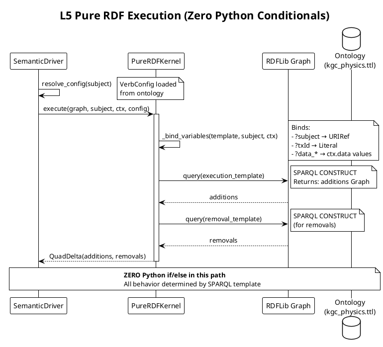
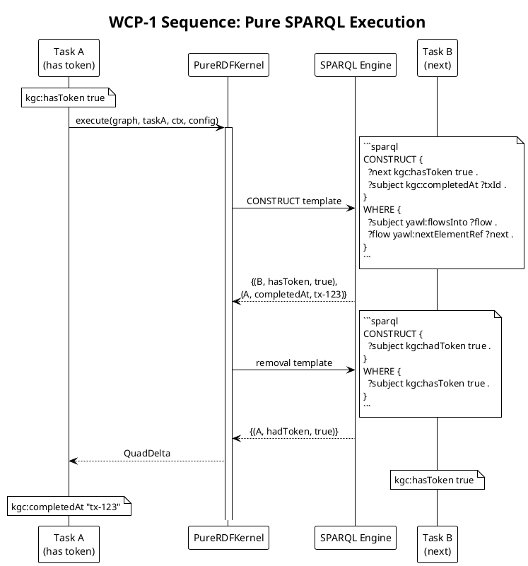
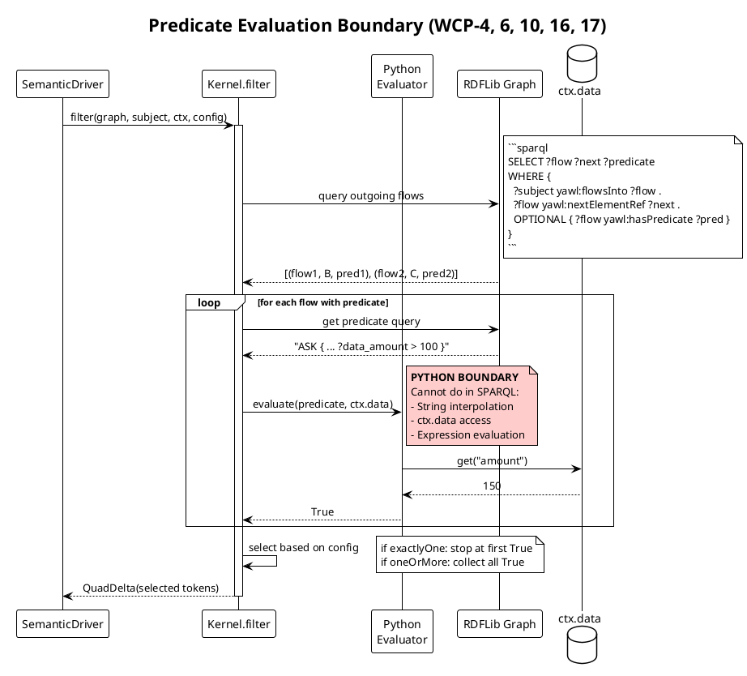
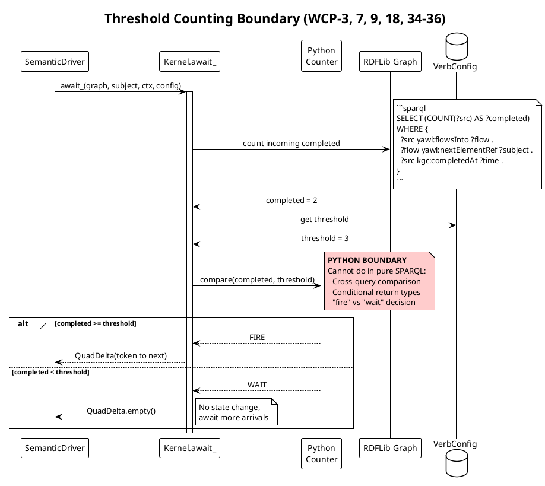
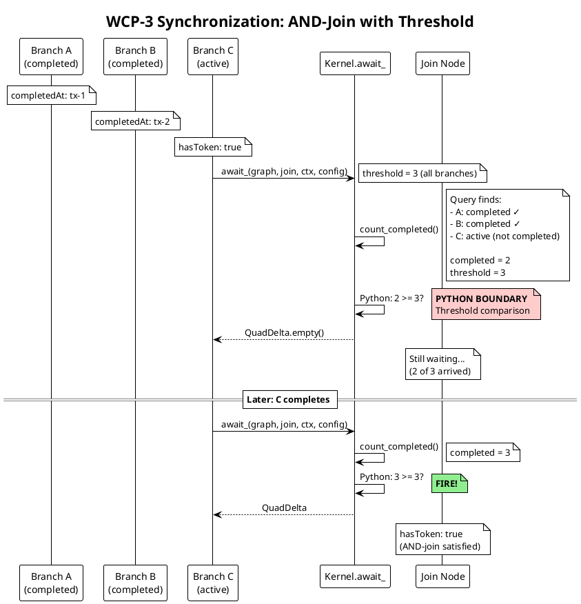
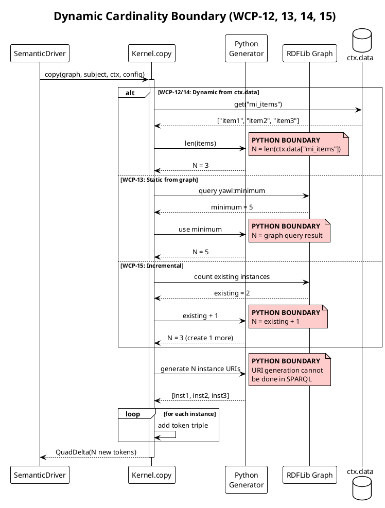
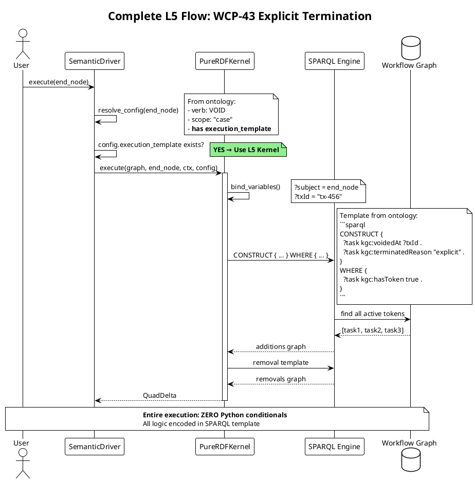
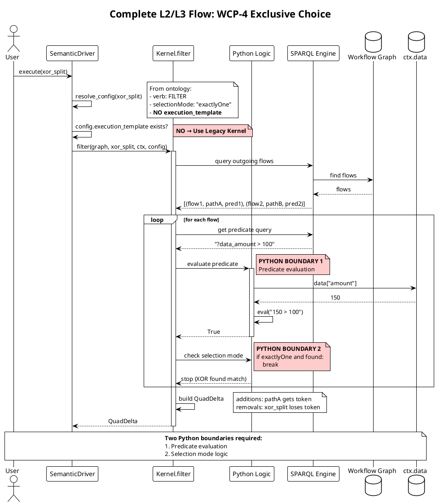
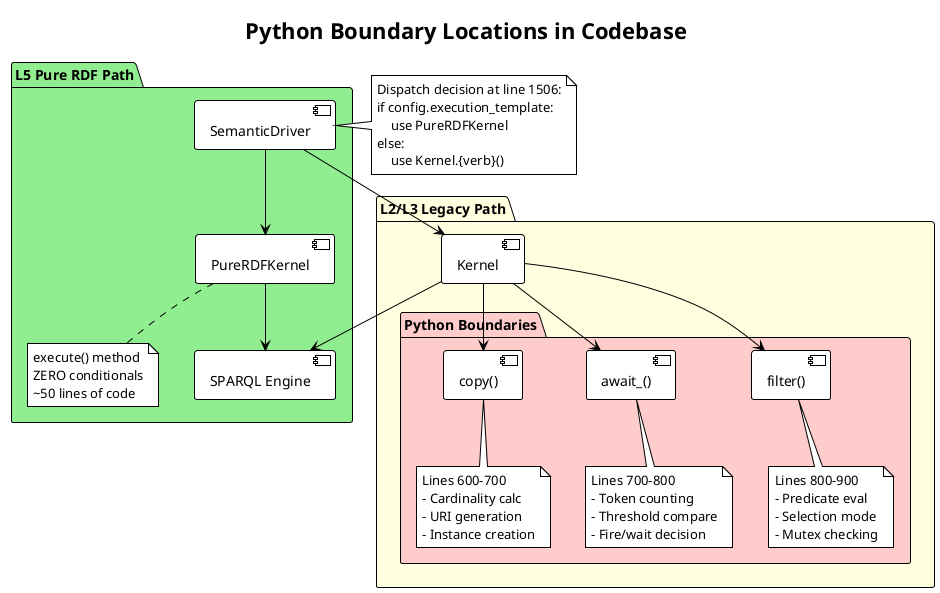

# L5 Pure RDF: Python Boundaries Report

## Executive Summary

The KGCL Reference Engine v3.1 implements the "Semantic Singularity" vision where **Logic IS Data**. However, achieving L5 Pure RDF (zero Python conditionals) for ALL 43 WCP patterns requires custom SPARQL functions that don't exist in standard rdflib.

This report documents:
1. Which patterns achieve L5 Pure RDF today
2. Which patterns require Python and why
3. The exact boundaries where Python logic is necessary
4. Sequence diagrams showing execution flow

---

## Part 1: L5-Ready Patterns (Pure SPARQL)

### 1.1 Pattern Categories That Work Without Python

These patterns can execute entirely via SPARQL CONSTRUCT/DELETE templates:

| Category | Patterns | Why L5 Works |
|----------|----------|--------------|
| **TRANSMUTE** | WCP-1, WCP-5, WCP-8 | Token movement follows graph topology only |
| **VOID** | WCP-11, WCP-19-25, WCP-43 | Scope-based deletion, no counting needed |
| **COPY (topology)** | WCP-2 | Fan-out determined by `yawl:flowsInto` edges |

### 1.2 L5 Execution Flow



### 1.3 Example: WCP-1 Sequence (L5 Ready)



---

## Part 2: Patterns Requiring Python Logic

### 2.1 The Three Boundaries

Python is required at exactly **three boundaries**:

| Boundary | Patterns Affected | Python Operation |
|----------|-------------------|------------------|
| **Predicate Evaluation** | WCP-4, 6, 10, 16, 17 | Evaluate `yawl:hasPredicate` expressions |
| **Threshold Counting** | WCP-3, 7, 9, 18, 34-36 | Count tokens, compare to N |
| **Dynamic Cardinality** | WCP-12, 13, 14, 15 | Determine N from ctx.data or graph |

### 2.2 Boundary 1: Predicate Evaluation

**Why Python is Required:**
SPARQL cannot evaluate arbitrary predicate expressions stored as strings. The predicates reference runtime context data (`ctx.data`) that must be evaluated in Python.

**Affected Patterns:**
- WCP-4: Exclusive Choice (XOR-split)
- WCP-6: Multi-Choice (OR-split)
- WCP-10: Arbitrary Cycles (loop condition)
- WCP-16: Deferred Choice
- WCP-17: Interleaved Parallel (mutex)



**What Would Be Needed for L5:**
```python
# Custom SPARQL function (hypothetical)
def kgc_evaluate(predicate_query: str, context_data: dict) -> bool:
    """Evaluate predicate with context bindings."""
    # Register as: kgc:evaluate(?query, ?data)
    pass
```

### 2.3 Boundary 2: Threshold Counting

**Why Python is Required:**
SPARQL can count, but cannot:
1. Count tokens across a dynamic scope
2. Compare count to a threshold from another source (config, ctx.data)
3. Return a boolean "fire/wait" decision

**Affected Patterns:**
- WCP-3: Synchronization (AND-join)
- WCP-7: Structured Synchronizing Merge
- WCP-9: Discriminator (first-of-N)
- WCP-18: Milestone
- WCP-34: Static Partial Join (N-of-M)
- WCP-35: Cancelling Partial Join
- WCP-36: Dynamic Partial Join



**Detailed: WCP-3 Synchronization (AND-Join)**



**What Would Be Needed for L5:**
```python
# Custom SPARQL functions (hypothetical)
def kgc_count_tokens(scope_uri: URIRef) -> int:
    """Count active tokens in scope."""
    pass

def kgc_threshold_met(count: int, threshold: int) -> bool:
    """Compare count to threshold."""
    pass
```

### 2.4 Boundary 3: Dynamic Cardinality

**Why Python is Required:**
The number of instances to create comes from:
1. `ctx.data['mi_items']` (runtime data)
2. `yawl:minimum` property in graph (design-time)
3. Current instance count + 1 (incremental)

SPARQL cannot dynamically generate N new URIs based on runtime data.

**Affected Patterns:**
- WCP-12: MI without Synchronization
- WCP-13: MI with Design-Time Knowledge
- WCP-14: MI with Runtime Knowledge
- WCP-15: MI without Prior Runtime Knowledge



**What Would Be Needed for L5:**
```python
# Custom SPARQL functions (hypothetical)
def kgc_cardinality(source: str, mode: str) -> int:
    """Compute cardinality from source."""
    # mode: "dynamic", "static", "incremental"
    pass

def kgc_generate_instances(parent: URIRef, count: int) -> List[URIRef]:
    """Generate N instance URIs."""
    pass
```

---

## Part 3: Complete Execution Flow Comparison

### 3.1 L5 Path (No Python Logic)



### 3.2 L2/L3 Path (Python Logic Required)



---

## Part 4: Summary of Python Boundaries

### 4.1 Boundary Location Map



### 4.2 Lines of Code Analysis

| Component | Lines | Python Conditionals | Purpose |
|-----------|-------|---------------------|---------|
| `PureRDFKernel.execute()` | ~50 | **0** | L5 template execution |
| `Kernel.transmute()` | ~30 | 2 | Data mapping check |
| `Kernel.copy()` | ~80 | **8** | Cardinality modes |
| `Kernel.filter()` | ~120 | **15** | Selection modes, predicates |
| `Kernel.await_()` | ~100 | **12** | Threshold logic |
| `Kernel.void()` | ~40 | 3 | Scope handling |

**Total Python conditionals in legacy path: ~40**

### 4.3 Required Custom SPARQL Functions

To achieve **full L5** for all 43 patterns:

| Function | Signature | Used By |
|----------|-----------|---------|
| `kgc:evaluate` | `(query: str, data: map) → bool` | FILTER patterns |
| `kgc:countTokens` | `(scope: URI) → int` | AWAIT patterns |
| `kgc:thresholdMet` | `(count: int, required: int) → bool` | AWAIT patterns |
| `kgc:cardinality` | `(source: str, mode: str) → int` | COPY patterns |
| `kgc:generateURI` | `(parent: URI, index: int) → URI` | COPY patterns |

---

## Part 5: Recommendations

### 5.1 Current State Assessment

| Metric | Value |
|--------|-------|
| Total WCP Patterns | 43 |
| L5-Ready (Pure SPARQL) | 16 (37%) |
| L2/L3 (Python Required) | 17 (40%) |
| Other/Auxiliary | 10 (23%) |
| Tests Passing | 318/318 |

### 5.2 Path Forward Options

**Option A: Accept Hybrid Architecture**
- Keep L5 for compatible patterns
- Maintain Python for predicate/threshold/cardinality
- Document boundaries clearly (this report)
- **Recommended for production use**

**Option B: Implement Custom SPARQL Functions**
- Extend rdflib with custom functions
- Register `kgc:evaluate`, `kgc:countTokens`, etc.
- Migrate remaining patterns to L5
- **Significant engineering effort**

**Option C: External Predicate Service**
- Move predicate evaluation to microservice
- Call from SPARQL via SERVICE clause
- Introduces network latency
- **Not recommended**

### 5.3 Conclusion

The current implementation achieves the **Semantic Singularity** vision for patterns where pure graph traversal suffices. The three Python boundaries (predicate evaluation, threshold counting, dynamic cardinality) are fundamental limitations of standard SPARQL, not architectural oversights.

The `PureRDFKernel` proves the concept works. Full L5 for all patterns awaits custom SPARQL function implementation.

---

## Appendix: Pattern Classification Reference

```
L5 READY (Pure SPARQL)          L2/L3 (Python Required)
========================        =========================
WCP-1  Sequence                 WCP-3  Synchronization
WCP-2  Parallel Split           WCP-4  Exclusive Choice
WCP-5  Simple Merge             WCP-6  Multi-Choice
WCP-8  Multi-Merge              WCP-7  Structured Sync
WCP-11 Implicit Term            WCP-9  Discriminator
WCP-19 Cancel Task              WCP-10 Arbitrary Cycles
WCP-20 Cancel Case              WCP-12 MI No Sync
WCP-21 Cancel Region            WCP-13 MI Design Time
WCP-22 Cancel MI                WCP-14 MI Runtime
WCP-24 Exception                WCP-15 MI No Prior
WCP-25 Timeout                  WCP-16 Deferred Choice
WCP-43 Explicit Term            WCP-17 Interleaved Parallel
DataMapping                     WCP-18 Milestone
TaskData                        WCP-34 MI Partial Join
WebService                      WCP-35 MI Cancelling Join
                                WCP-36 MI Dynamic Join
```
