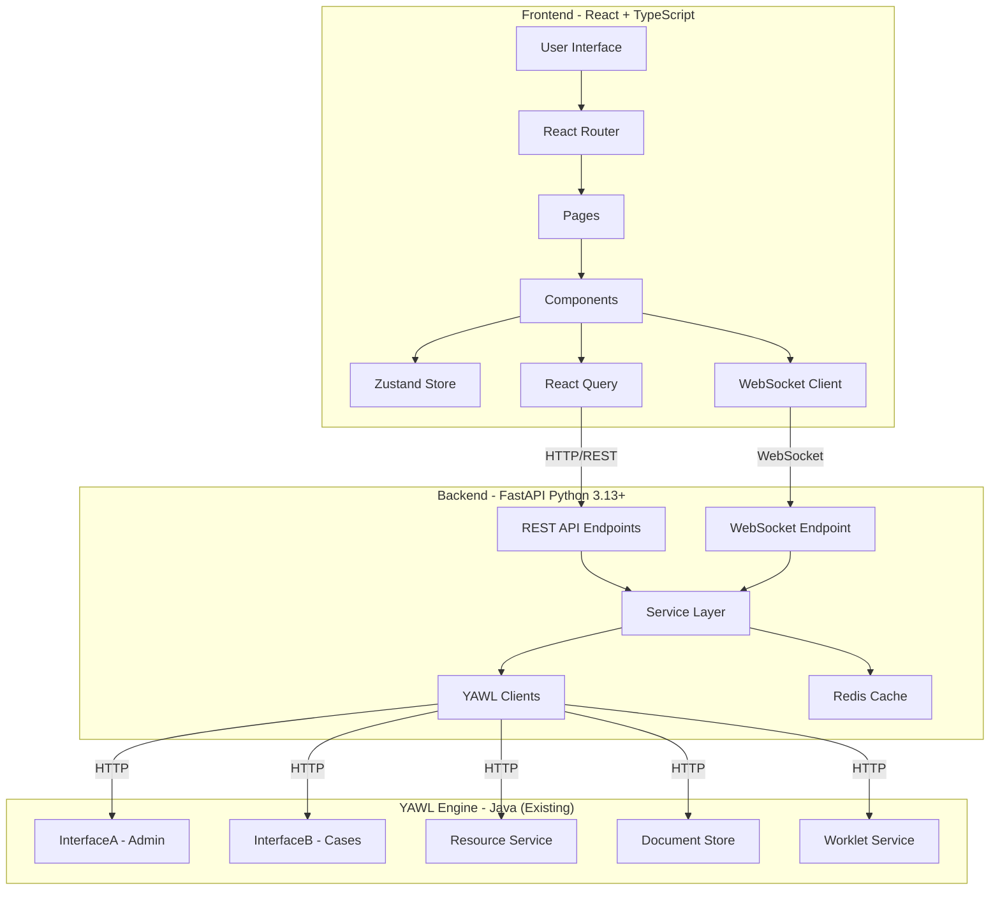
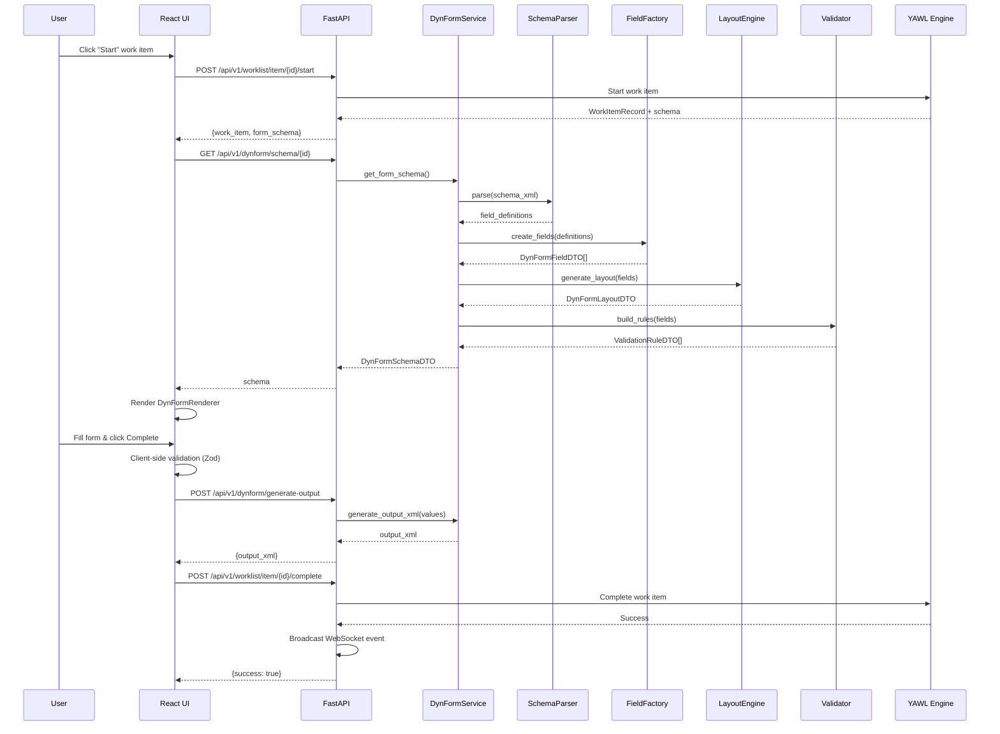

# YAWL UI Architecture Diagrams

## Component Interaction Diagram



## Dynamic Form Processing Flow



## Package Structure Map

```
┌─────────────────────────────────────────────────────────────┐
│                    YAWL UI Project                           │
├─────────────────────────────────────────────────────────────┤
│                                                              │
│  Backend (src/kgcl/yawl_ui/)          Frontend (frontend/)  │
│  ┌─────────────────────┐              ┌──────────────────┐  │
│  │ api/v1/             │              │ src/             │  │
│  │  ├─ worklist.py     │              │  ├─ api/        │  │
│  │  ├─ dynform.py      │              │  ├─ components/ │  │
│  │  ├─ cases.py        │              │  ├─ pages/      │  │
│  │  ├─ resources.py    │              │  ├─ store/      │  │
│  │  ├─ orgdata.py      │              │  ├─ hooks/      │  │
│  │  ├─ specifications.py              │  └─ utils/      │  │
│  │  ├─ auth.py         │              │                 │  │
│  │  └─ websocket.py    │              └──────────────────┘  │
│  └─────────────────────┘                                    │
│  ┌─────────────────────┐                                    │
│  │ services/           │                                    │
│  │  ├─ worklist_service.py                                 │
│  │  ├─ dynform_service.py (CRITICAL)                       │
│  │  ├─ case_service.py │                                    │
│  │  ├─ resource_service.py                                 │
│  │  └─ ...             │                                    │
│  └─────────────────────┘                                    │
│  ┌─────────────────────┐                                    │
│  │ clients/            │                                    │
│  │  ├─ engine_client.py│                                    │
│  │  ├─ resource_client.py                                  │
│  │  ├─ docstore_client.py                                  │
│  │  └─ worklet_client.py                                   │
│  └─────────────────────┘                                    │
│  ┌─────────────────────┐                                    │
│  │ dynform/ (26 files)│                                    │
│  │  ├─ schema_parser.py│                                    │
│  │  ├─ field_factory.py│                                    │
│  │  ├─ validator.py    │                                    │
│  │  ├─ layout_engine.py│                                    │
│  │  ├─ attributes/     │                                    │
│  │  └─ components/     │                                    │
│  └─────────────────────┘                                    │
│                                                              │
└─────────────────────────────────────────────────────────────┘
```

## Migration Phases Timeline

```
Week  1-2:  ████████░░░░░░░░░░░░░░░░░░░░  Core Infrastructure
Week  3-4:  ░░░░░░░░████████░░░░░░░░░░░░  Worklist Views
Week  5-7:  ░░░░░░░░░░░░░░░░████████████  DynForm System (CRITICAL)
Week  8-9:  ░░░░░░░░░░░░░░░░░░░░░░░░████  Resource Management
Week 10-11: ░░░░░░░░░░░░░░░░░░░░░░░░░░██  Case & Spec Management
Week 12-13: ░░░░░░░░░░░░░░░░░░░░░░░░░░░█  Advanced Features
Week 14-15: ░░░░░░░░░░░░░░░░░░░░░░░░░░░█  Testing & Optimization

Legend: █ Active Development  ░ Planning/Future
```

## API Endpoint Organization

```
/api/v1/
├── auth/
│   ├── POST   /login
│   ├── POST   /refresh
│   ├── POST   /logout
│   └── GET    /me
├── worklist/
│   ├── GET    /user/{user_id}
│   ├── GET    /team/{group_id}
│   ├── GET    /admin
│   └── /item/{item_id}/
│       ├── POST   /start
│       ├── POST   /complete
│       ├── POST   /deallocate
│       ├── POST   /reallocate
│       ├── POST   /skip
│       ├── POST   /pile
│       ├── POST   /suspend
│       └── POST   /unsuspend
├── dynform/
│   ├── GET    /schema/{item_id}
│   ├── POST   /validate
│   ├── POST   /generate-output
│   ├── GET    /user-attributes/{user_id}
│   └── POST   /subpanel/clone
├── cases/
│   ├── GET    /
│   ├── GET    /{case_id}
│   ├── POST   /launch
│   ├── POST   /{case_id}/cancel
│   └── GET    /{case_id}/workitems
├── specs/
│   ├── GET    /
│   ├── POST   /upload
│   ├── POST   /{spec_id}/unload
│   ├── GET    /{spec_id}/info
│   └── GET    /{spec_id}/case-params
├── resources/
│   ├── /participants/
│   │   ├── GET    /
│   │   ├── GET    /{id}
│   │   ├── POST   /
│   │   ├── PUT    /{id}
│   │   └── DELETE /{id}
│   ├── /nonhuman/
│   │   └── GET    /
│   └── /categories/
│       └── GET    /
├── orgdata/
│   ├── GET    /roles
│   ├── GET    /positions
│   ├── GET    /capabilities
│   ├── GET    /orggroups
│   ├── POST   /{entity_type}
│   ├── PUT    /{entity_type}/{id}
│   └── DELETE /{entity_type}/{id}
├── calendar/
│   ├── GET    /{user_id}/events
│   └── POST   /delayed-start
└── /ws/
    └── /notifications
```

## Critical Path: DynForm Conversion

```
Java DynForm System (26 files)          Python DynForm System
┌─────────────────────────┐             ┌──────────────────────┐
│ DynFormFactory.java     │────────────▶│ dynform_service.py   │
│ DynFormField.java       │────────────▶│ models/dynform.py    │
│ DynFormValidator.java   │────────────▶│ validator.py         │
│ DynFormLayout.java      │────────────▶│ layout_engine.py     │
│ DynTextParser.java      │────────────▶│ schema_parser.py     │
│ DataListGenerator.java  │────────────▶│ data_generator.py    │
│ DynFormFieldAssembler   │────────────▶│ field_factory.py     │
│ SubPanel.java           │────────────▶│ components/subpanel.py
│ SubPanelController.java │────────────▶│ components/subpanel.py
│ DynAttributeFactory.java│────────────▶│ attributes/factory.py│
│ AbstractDynAttribute    │────────────▶│ attributes/base.py   │
└─────────────────────────┘             └──────────────────────┘
                 │
                 │
                 ▼
        React Components
┌──────────────────────────────┐
│ DynFormRenderer.tsx          │
│ DynFormField.tsx             │
│ DynFormValidator.tsx         │
│ DynFormLayout.tsx            │
│ fields/                      │
│  ├─ TextField.tsx            │
│  ├─ TextAreaField.tsx        │
│  ├─ SelectField.tsx          │
│  ├─ DateField.tsx            │
│  ├─ SubPanelField.tsx        │
│  └─ ...                      │
└──────────────────────────────┘
```

## Technology Stack Summary

```
┌─────────────────────────────────────────────────┐
│               Technology Stack                   │
├─────────────────────────────────────────────────┤
│                                                  │
│  Frontend                  Backend               │
│  ┌──────────────┐         ┌──────────────┐     │
│  │ React 18     │         │ FastAPI 0.100+│     │
│  │ TypeScript   │         │ Python 3.13+  │     │
│  │ Ant Design 5 │         │ Pydantic v2   │     │
│  │ Zustand      │         │ httpx         │     │
│  │ React Query  │         │ Redis         │     │
│  │ React Hook   │         │ WebSocket     │     │
│  │   Form       │         │ pytest        │     │
│  │ Zod          │         │               │     │
│  │ Axios        │         │               │     │
│  │ Socket.IO    │         │               │     │
│  │ Tailwind CSS │         │               │     │
│  │ Vite         │         │               │     │
│  └──────────────┘         └──────────────┘     │
│                                                  │
│  Infrastructure              YAWL Engine         │
│  ┌──────────────┐         ┌──────────────┐     │
│  │ Nginx        │         │ InterfaceA   │     │
│  │ Redis        │         │ InterfaceB   │     │
│  │ Docker       │         │ Resource Svc │     │
│  │              │         │ DocStore     │     │
│  │              │         │ Worklet Svc  │     │
│  └──────────────┘         └──────────────┘     │
│                                                  │
└─────────────────────────────────────────────────┘
```

## State Management Architecture

```
┌────────────────────────────────────────────────────────┐
│                 State Management                        │
├────────────────────────────────────────────────────────┤
│                                                         │
│  Global UI State (Zustand)    Server State (React Query)│
│  ┌──────────────────────┐    ┌──────────────────────┐ │
│  │ authStore            │    │ worklist queries     │ │
│  │  ├─ user            │    │  ├─ useUserWorklist │ │
│  │  ├─ accessToken     │    │  ├─ useTeamWorklist │ │
│  │  └─ refreshToken    │    │  └─ useAdminWorklist│ │
│  │                      │    │                      │ │
│  │ notificationStore    │    │ case queries         │ │
│  │  ├─ notifications   │    │  ├─ useCases        │ │
│  │  └─ unreadCount     │    │  └─ useCaseDetails  │ │
│  │                      │    │                      │ │
│  │ uiStore              │    │ resource queries     │ │
│  │  ├─ sidebarOpen     │    │  ├─ useParticipants │ │
│  │  ├─ currentView     │    │  ├─ useOrgData      │ │
│  │  └─ theme           │    │  └─ useNonHuman     │ │
│  └──────────────────────┘    │                      │ │
│                               │ spec queries         │ │
│  Persisted:                   │  └─ useSpecs        │ │
│  localStorage                 └──────────────────────┘ │
│  (auth, theme)                                         │
│                               Cached:                  │
│                               React Query              │
│                               (auto-invalidation)      │
│                                                         │
└────────────────────────────────────────────────────────┘
```
