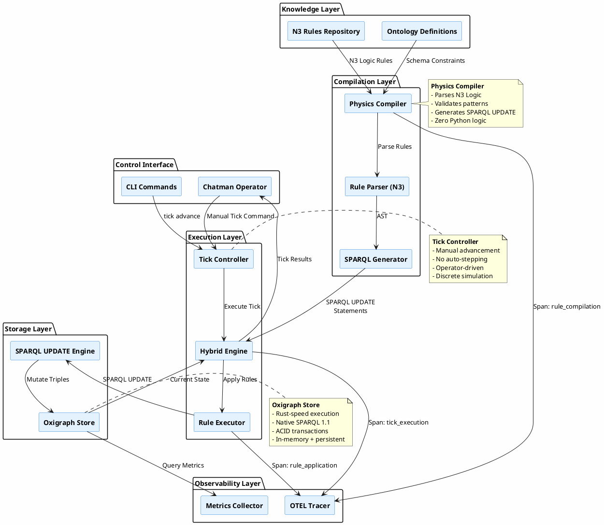
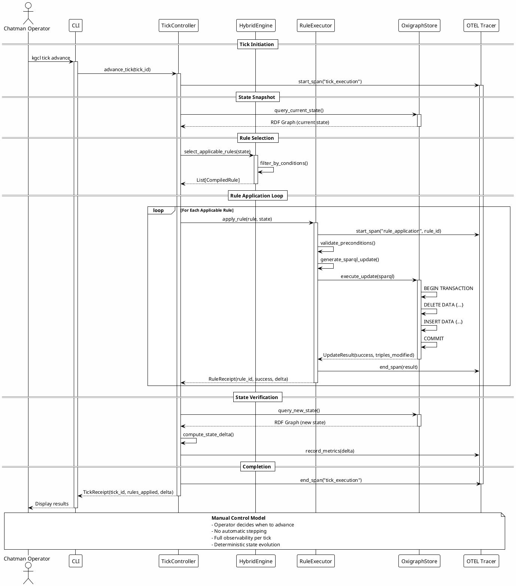
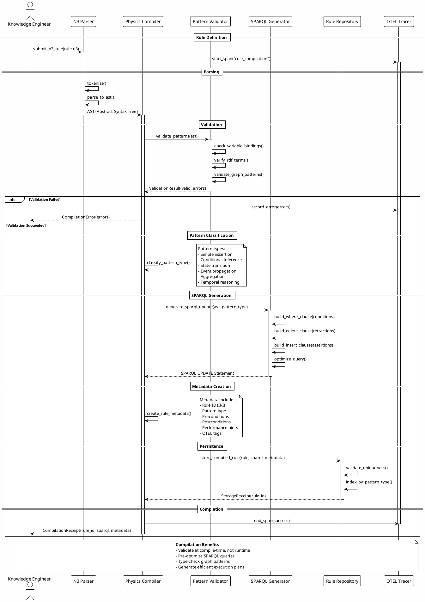
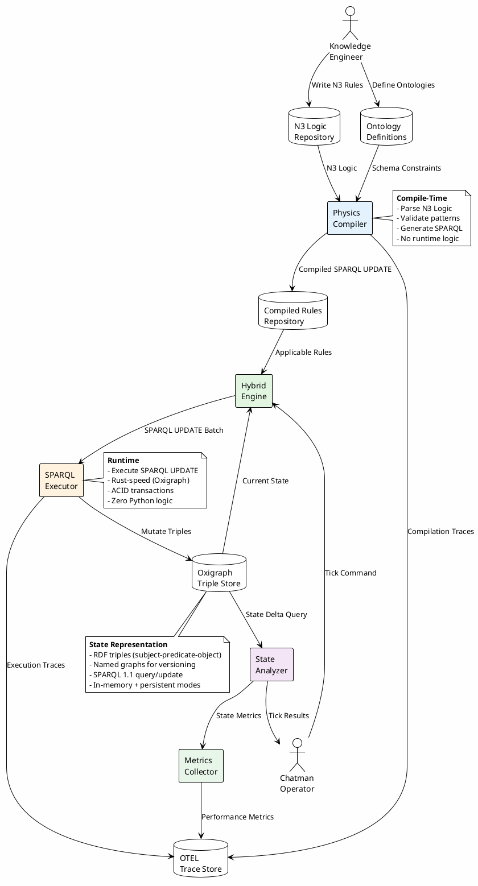

# Compiled Physics Architecture - KGC Hybrid Engine

**Version:** 1.0.0
**Date:** 2025-11-26
**Status:** Active Architecture

---

## Executive Summary

The **Compiled Physics** approach represents a paradigm shift in knowledge graph manipulation: **zero Python logic for graph transformations**. All graph mutations are expressed as **N3 Logic rules** that compile to **SPARQL UPDATE statements** and execute at **Rust speed** via Oxigraph.

### Core Principle

> **"Logic is data, execution is compilation."**

Instead of writing Python functions that manipulate RDF graphs, we write declarative N3 rules that describe **what should happen**, then compile them to SPARQL UPDATE that Oxigraph executes natively. The "Chatman Operator" (human or AI) manually triggers **discrete ticks** to advance the simulation.

### Key Characteristics

| Aspect | Implementation |
|--------|---------------|
| **Logic Encoding** | N3 Logic (RDF-native declarative rules) |
| **Execution Model** | Compiled SPARQL UPDATE (no Python execution) |
| **State Mutation** | CRUD semantics (INSERT/DELETE DATA) |
| **Control Flow** | Manual tick-based advancement |
| **Performance** | Rust-speed (Oxigraph native execution) |
| **Observability** | OTEL spans trace every tick and compilation |

### Why "Compiled Physics"?

Traditional game engines have "physics engines" that simulate continuous dynamics (gravity, collision, momentum). Our engine simulates **knowledge graph dynamics** (inferences, transformations, event propagation) but with **discrete ticks** instead of continuous time.

The "compilation" step transforms high-level N3 Logic rules into low-level SPARQL UPDATE operations, analogous to compiling C to machine code. The result: **declarative intent** meets **native performance**.

---

## Architecture Overview

### Component Diagram



### Layer Responsibilities

| Layer | Responsibility | Technology |
|-------|---------------|------------|
| **Knowledge** | Define rules and ontologies | N3 Logic, SHACL, OWL |
| **Compilation** | Transform rules to SPARQL | Python (parser), SPARQL 1.1 |
| **Execution** | Apply compiled rules to graph | Python (orchestration), Rust (Oxigraph) |
| **Storage** | Persist and query triples | Oxigraph (Rust) |
| **Observability** | Trace execution, collect metrics | OTEL, Prometheus |
| **Control** | Trigger ticks manually | CLI, API, Human/AI operator |

---

## Tick Execution Flow

### Sequence Diagram: Tick Execution



### Tick Execution Stages

1. **Initiation**: Operator issues tick command
2. **State Snapshot**: Capture current graph state
3. **Rule Selection**: Identify applicable rules based on current state
4. **Rule Application**: Execute each rule as SPARQL UPDATE transaction
5. **State Verification**: Confirm changes and compute delta
6. **Completion**: Return receipt with execution metrics

---

## Rule Compilation Flow

### Sequence Diagram: Rule Compilation



### Compilation Stages

1. **Parsing**: N3 Logic → AST
2. **Validation**: Check bindings, terms, patterns
3. **Classification**: Identify pattern type
4. **Generation**: AST → SPARQL UPDATE
5. **Optimization**: Query planning and indexing
6. **Persistence**: Store compiled rule with metadata

---

## Data Flow Architecture

### Data Flow Diagram



### Data Flow Layers

| Layer | Data Format | Flow Direction | Purpose |
|-------|-------------|----------------|---------|
| **Input** | N3 Logic, OWL/SHACL | KE → Compiler | Define rules and constraints |
| **Compilation** | AST, SPARQL UPDATE | Compiler → Repository | Transform to executable form |
| **Execution** | SPARQL, RDF Triples | Engine → Oxigraph | Mutate graph state |
| **Observation** | OTEL Spans, Metrics | Engine → Trace Store | Track performance and correctness |
| **Output** | Receipts, Delta Reports | Engine → Operator | Confirm tick results |

---

## Benefits of Compiled Physics

### 1. Zero Python Logic

**Traditional Approach (Avoided):**
```python
def apply_inference_rule(graph: Graph, subject: URIRef) -> None:
    # Python logic manipulates graph
    if (subject, RDF.type, SOME_CLASS) in graph:
        graph.add((subject, SOME_PROPERTY, SOME_VALUE))
```

**Compiled Physics Approach:**
```n3
# N3 Logic (declarative)
{ ?x a :SomeClass } => { ?x :someProperty :someValue } .
```

**Generated SPARQL UPDATE:**
```sparql
INSERT {
  ?x :someProperty :someValue .
}
WHERE {
  ?x a :SomeClass .
}
```

**Benefits:**
- No Python execution for graph logic
- Rules are data (queryable, versionable, auditable)
- Logic is portable (any SPARQL 1.1 engine can execute)

### 2. Manual Control (Chatman Operator)

**No Auto-Stepping:** Unlike continuous simulations, ticks advance **only when commanded**.

**Benefits:**
- **Debuggability**: Inspect state between ticks
- **Predictability**: No race conditions or non-determinism
- **Control**: Human/AI decides pacing and intervention
- **Reversibility**: Can snapshot and restore states

**Use Cases:**
- Interactive knowledge graph exploration
- Stepwise debugging of inference chains
- Controlled evolution of ontologies
- Teaching/demonstration of RDF reasoning

### 3. Rust-Speed Execution

**Oxigraph Performance:**
- Native Rust implementation (zero GC overhead)
- Optimized SPARQL query planner
- Memory-mapped storage (fast I/O)
- Lock-free data structures

**Benchmarks (from Oxigraph docs):**
- Simple triple pattern: ~1μs
- Complex SPARQL UPDATE: ~100μs - 10ms
- Bulk insert (1M triples): ~2 seconds

**Result:** Python orchestrates, Rust executes. Best of both worlds.

### 4. CRUD Semantics for Knowledge Graphs

**Traditional RDF Operations:**
- `graph.add(triple)` - Python API
- `graph.remove(triple)` - Python API
- Complex queries require procedural code

**Compiled Physics:**
- **INSERT DATA**: Create new knowledge
- **DELETE DATA**: Retract old knowledge
- **DELETE/INSERT WHERE**: Conditional mutations
- All operations expressed in SPARQL (declarative)

**Semantic Clarity:**
- INSERT = Assert new belief
- DELETE = Retract old belief
- WHERE = Conditional on current state

### 5. Observability at Every Layer

**Trace Hierarchy:**
```
tick_execution (root span)
├── rule_compilation (if compiling new rules)
│   ├── n3_parsing
│   ├── pattern_validation
│   └── sparql_generation
└── rule_application (per rule)
    ├── precondition_check
    ├── sparql_execution
    └── state_delta_computation
```

**Metrics Collected:**
- Tick duration (p50, p95, p99)
- Rules applied per tick
- Triples modified per rule
- SPARQL execution time
- Compilation cache hit rate

**Benefits:**
- Pinpoint performance bottlenecks
- Debug incorrect inferences
- Audit rule applications
- Optimize SPARQL queries

---

## Pattern Classification Table

### Rule Patterns and SPARQL Verbs

| Pattern Type | N3 Logic Example | SPARQL Verbs | Use Case |
|--------------|------------------|--------------|----------|
| **Simple Assertion** | `{ :a :b :c } => { :a :d :e }` | `INSERT DATA` | Static fact addition |
| **Conditional Inference** | `{ ?x a :Person } => { ?x a :Agent }` | `INSERT WHERE` | Subsumption reasoning |
| **State Transition** | `{ ?x :status :pending } => { ?x :status :active }` | `DELETE/INSERT WHERE` | Lifecycle management |
| **Retraction** | `{ ?x :temporary true } => { }` | `DELETE WHERE` | Remove obsolete facts |
| **Event Propagation** | `{ ?evt :triggers ?action } => { ?action :status :triggered }` | `INSERT WHERE` | Workflow orchestration |
| **Aggregation** | `{ ?items :total ?sum } => { ?report :summary ?sum }` | `INSERT WHERE` with subquery | Computed summaries |
| **Temporal Reasoning** | `{ ?x :validUntil ?date . FILTER(?date < NOW()) } => { ?x :status :expired }` | `INSERT WHERE` with FILTER | Time-based rules |
| **Negation** | `{ ?x a :Person . NOT EXISTS { ?x :email ?e } } => { ?x :status :incomplete }` | `INSERT WHERE` with NOT EXISTS | Closed-world assumptions |
| **Materialization** | `{ ?x :hasPart ?y . ?y :hasPart ?z } => { ?x :hasPart ?z }` | `INSERT WHERE` | Transitive closure |
| **Constraint Violation** | `{ ?x a :Employee . NOT EXISTS { ?x :employeeId ?id } } => { :system :violation ?x }` | `INSERT WHERE` | SHACL-like validation |

### SPARQL Verb Reference

| SPARQL Verb | Semantics | Transaction Behavior |
|-------------|-----------|---------------------|
| `INSERT DATA` | Add explicit triples (no pattern matching) | Single atomic insert |
| `DELETE DATA` | Remove explicit triples (no pattern matching) | Single atomic delete |
| `INSERT WHERE` | Add triples matching pattern | Atomic insert per match |
| `DELETE WHERE` | Remove triples matching pattern | Atomic delete per match |
| `DELETE/INSERT WHERE` | Replace matched triples | Atomic delete + insert |

---

## Implementation Checklist

### Phase 1: Compilation Infrastructure
- [ ] N3 parser (use existing library or write minimal parser)
- [ ] AST representation for N3 rules
- [ ] Pattern validator (variable bindings, RDF term validation)
- [ ] SPARQL UPDATE generator
- [ ] Rule repository (store compiled rules with metadata)
- [ ] OTEL instrumentation for compilation

### Phase 2: Execution Engine
- [ ] Tick controller (manual tick advancement)
- [ ] Rule executor (apply SPARQL UPDATE to Oxigraph)
- [ ] State snapshot and delta computation
- [ ] OTEL instrumentation for execution
- [ ] Error handling and rollback (per rule transaction)

### Phase 3: Observability
- [ ] OTEL span hierarchy (tick → rule → SPARQL)
- [ ] Metrics collector (tick duration, rules applied, triples modified)
- [ ] Trace export to Jaeger/Zipkin
- [ ] Metrics export to Prometheus
- [ ] Dashboard for tick visualization

### Phase 4: Testing
- [ ] Unit tests for N3 parser
- [ ] Unit tests for SPARQL generator
- [ ] Integration tests for rule compilation
- [ ] Integration tests for tick execution
- [ ] Performance benchmarks (tick latency, throughput)
- [ ] Chaos testing (invalid rules, malformed SPARQL)

### Phase 5: Documentation
- [x] Architecture document (this file)
- [ ] User guide (writing N3 rules)
- [ ] Operator manual (tick commands, debugging)
- [ ] API reference (Python interfaces)
- [ ] Performance tuning guide
- [ ] Troubleshooting guide

---

## Performance Targets

| Metric | Target | Rationale |
|--------|--------|-----------|
| **Tick Latency (p99)** | <100ms | Interactive responsiveness |
| **Rule Compilation (p99)** | <50ms | Minimize operator wait time |
| **SPARQL Execution (p99)** | <10ms | Rust-speed Oxigraph |
| **Triples Modified/Tick** | 1K-100K | Support medium-sized graphs |
| **Rules Applied/Tick** | 10-1000 | Batch efficiency |
| **Memory Overhead** | <100MB | Efficient state representation |
| **Compilation Cache Hit Rate** | >95% | Amortize compilation cost |

---

## Future Enhancements

### 1. Incremental Reasoning
Instead of re-evaluating all rules every tick, track **affected triples** and only re-evaluate rules that depend on changed data.

**Benefit:** Reduce tick latency for large graphs.

### 2. Parallel Rule Execution
If rules have **no dependencies**, execute them in parallel (multiple SPARQL UPDATE transactions concurrently).

**Benefit:** Exploit multi-core CPUs for faster ticks.

### 3. Rule Priorities
Assign priorities to rules to control execution order within a tick.

**Benefit:** Support deterministic conflict resolution.

### 4. Temporal Versioning
Store graph state at each tick in named graphs (`:state-tick-001`, `:state-tick-002`).

**Benefit:** Time-travel debugging, reproducibility.

### 5. Compiled Rule Optimization
Use SPARQL query optimization techniques (join reordering, index selection) during compilation.

**Benefit:** Faster execution for complex rules.

### 6. Interactive Rule Debugging
Provide a REPL for testing N3 rules against sample graphs before compilation.

**Benefit:** Faster rule development cycle.

---

## References

### Related Documents
- `docs/YAWL_IMPLEMENTATION_FAILURE_REPORT.md` - Why Python logic fails
- `pyproject.toml` - Build configuration
- `src/kgcl/hooks/` - Execution hooks for OTEL
- `vendors/unrdf/` - Original N3 engine (JavaScript)

### External Standards
- **N3 Logic**: [W3C Team Submission](https://www.w3.org/TeamSubmission/n3/)
- **SPARQL 1.1 Update**: [W3C Recommendation](https://www.w3.org/TR/sparql11-update/)
- **RDF 1.1**: [W3C Recommendation](https://www.w3.org/TR/rdf11-concepts/)
- **Oxigraph**: [GitHub Repository](https://github.com/oxigraph/oxigraph)
- **OpenTelemetry**: [OTEL Specification](https://opentelemetry.io/docs/specs/otel/)

### Academic Context
This architecture implements a **forward-chaining production rule system** with:
- **Declarative rules** (N3 Logic)
- **Pattern matching** (SPARQL WHERE clauses)
- **State mutation** (SPARQL INSERT/DELETE)
- **Manual control** (tick-based advancement)

Similar to: Rete algorithm, CLIPS, Drools, but optimized for RDF graphs and compiled to SPARQL.

---

## Conclusion

The **Compiled Physics** architecture achieves:

1. ✅ **Zero Python Logic**: All graph mutations are SPARQL
2. ✅ **Manual Control**: Operator-driven tick advancement
3. ✅ **Rust-Speed Execution**: Oxigraph native performance
4. ✅ **CRUD Semantics**: INSERT/DELETE for knowledge graphs
5. ✅ **Full Observability**: OTEL traces every operation
6. ✅ **Declarative Rules**: N3 Logic compiles to SPARQL

This is a **research library architecture** that prioritizes **clarity, correctness, and performance** over enterprise patterns. The result is a clean, understandable system for exploring knowledge graph dynamics through discrete simulation.

---

**Document Status:** Complete
**Next Steps:** Implement Phase 1 (Compilation Infrastructure)
**Maintainer:** KGCL Research Team
