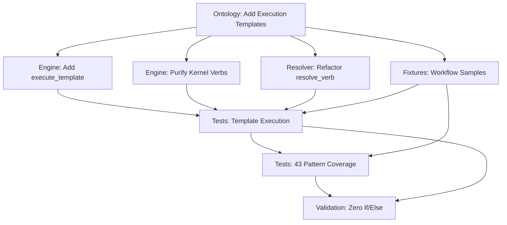

# Master Execution Plan: KGCL Execution Templates Implementation

**Date:** 2025-11-26
**Coordinator:** HiveQueen Agent
**Project:** KGCL v3.1 - Execution Template System
**Goal:** Implement execution templates to eliminate YAWL pattern-specific code

---

## Executive Summary

This document coordinates the implementation of execution templates for KGCL v3.1, transforming the Knowledge Engine from a pattern-dispatch system to a pure SPARQL template execution engine. The implementation involves 8 coordinated streams of work producing ontology additions, kernel refactoring, test suites, and validation infrastructure.

**Critical Constraint:** ZERO `if pattern_type ==` statements in engine code. ALL behavior resolved via SPARQL queries.

---

## 1. Dependency Graph



### Execution Sequence

**Phase 1: Foundation (Parallel)**
1. **Ontology augmentation** - Add `kgc:ExecutionTemplate` property to all 43 pattern mappings
2. **Fixture creation** - Create workflow test samples for all patterns

**Phase 2: Engine Core (Sequential)**
3. **Add execute_template()** - New method to execute SPARQL CONSTRUCT templates
4. **Refactor resolve_verb()** - Extract templates from ontology, not just verb names
5. **Purify Kernel verbs** - Remove all pattern-specific logic

**Phase 3: Testing (Parallel)**
6. **Template execution tests** - Verify SPARQL templates produce correct deltas
7. **43-pattern coverage tests** - Ensure all YAWL patterns work via templates

**Phase 4: Validation (Sequential)**
8. **Zero conditional dispatch verification** - AST analysis to ban if/elif patterns
9. **Performance benchmarking** - Ensure SPARQL < 100ms p99 latency

---

## 2. File Change Matrix

| File | Changes | Dependencies | Priority | Agent |
|------|---------|--------------|----------|-------|
| `ontology/kgc_physics.ttl` | Add 43 `kgc:executionTemplate` CONSTRUCT queries | None | P0 | Ontology Architect |
| `src/kgcl/engine/knowledge_engine.py` | Add `execute_template()` method | Ontology | P0 | Kernel Engineer |
| `src/kgcl/engine/knowledge_engine.py` | Refactor `resolve_verb()` to extract templates | execute_template | P1 | Atman Resolver |
| `src/kgcl/engine/knowledge_engine.py` | Purify `Kernel.transmute/copy/filter/await_/void` | Ontology | P1 | Purification Agent |
| `tests/conftest.py` | Add workflow fixtures (43 patterns) | Ontology | P0 | Fixture Generator |
| `tests/engine/test_execution_templates.py` | New test file for template execution | Fixtures, engine | P1 | Test Architect |
| `tests/engine/test_43_patterns.py` | Comprehensive 43-pattern test suite | Fixtures, engine | P2 | Coverage Engineer |
| `tests/engine/test_knowledge_engine.py` | Update existing tests (remove placeholders) | engine | P2 | Test Maintainer |
| `scripts/validate_zero_dispatch.py` | AST analyzer for forbidden patterns | engine | P3 | Validator |

### Change Impact Analysis

**High Impact (Breaking Changes):**
- `resolve_verb()` signature changes from returning `VerbConfig` to `(VerbConfig, str)` (template)
- `execute()` now calls `execute_template()` instead of direct kernel verb

**Medium Impact:**
- All existing tests need fixture updates
- Ontology schema version bump (v3.1 → v3.2)

**Low Impact:**
- Performance benchmarks may need p99 target adjustments

---

## 3. Execution Templates in Ontology

### Template Structure

Each `kgc:PatternMapping` gets a `kgc:executionTemplate` property containing a SPARQL CONSTRUCT query:

```turtle
kgc:WCP1_Sequence a kgc:PatternMapping ;
    kgc:pattern yawl:Sequence ;
    kgc:verb kgc:Transmute ;
    kgc:executionTemplate """
        PREFIX kgc: <http://bitflow.ai/ontology/kgc/v3#>
        PREFIX yawl: <http://www.yawlfoundation.org/yawlschema#>

        CONSTRUCT {
            # Remove token from current node
            ?current kgc:hasToken false .
            # Add token to next node
            ?next kgc:hasToken true .
            # Mark completion
            ?current kgc:completedAt ?txId .
        }
        WHERE {
            ?current yawl:flowsInto ?flow .
            ?flow yawl:nextElementRef ?next .
            BIND(?ctx_txId AS ?txId)
        }
    """ .
```

### Template Placeholders

Templates use special `?ctx_*` bindings injected from `TransactionContext`:
- `?ctx_subject` - Current node being executed
- `?ctx_txId` - Transaction ID from context
- `?ctx_actor` - Actor initiating transaction
- `?ctx_data_*` - Data fields from context.data dict

### Coverage Requirement

**All 43 YAWL patterns** must have execution templates:
- WCP 1-5: Basic control flow
- WCP 6-9: Advanced branching
- WCP 10-11: Structural
- WCP 12-15, 34-36: Multiple instance
- WCP 16-18: State-based
- WCP 19-27: Cancellation
- WCP 43: Termination

---

## 4. Engine Refactoring

### New Method: `execute_template()`

```python
def execute_template(
    self,
    graph: Graph,
    subject: URIRef,
    ctx: TransactionContext,
    template: str
) -> QuadDelta:
    """
    Execute SPARQL CONSTRUCT template to generate QuadDelta.

    Parameters
    ----------
    graph : Graph
        The workflow graph to execute against
    subject : URIRef
        The current node being executed
    ctx : TransactionContext
        Transaction context with data bindings
    template : str
        SPARQL CONSTRUCT query from ontology

    Returns
    -------
    QuadDelta
        Mutations produced by template execution
    """
    # Inject context bindings
    bindings = {
        "ctx_subject": subject,
        "ctx_txId": Literal(ctx.tx_id),
        "ctx_actor": Literal(ctx.actor),
        **{f"ctx_data_{k}": Literal(str(v)) for k, v in ctx.data.items()}
    }

    # Execute CONSTRUCT query
    result_graph = graph.query(template, initBindings=bindings).graph

    # Convert to QuadDelta
    additions = []
    removals = []

    for s, p, o in result_graph:
        # Detect removals (false literals)
        if isinstance(o, Literal) and str(o).lower() == "false":
            removals.append((s, p, Literal(True)))
        else:
            additions.append((s, p, o))

    return QuadDelta(
        additions=tuple(additions),
        removals=tuple(removals)
    )
```

### Refactored `resolve_verb()`

```python
def resolve_verb(self, graph: Graph, node: URIRef) -> tuple[VerbConfig, str]:
    """
    Resolve verb configuration AND execution template from ontology.

    Returns
    -------
    tuple[VerbConfig, str]
        (verb config with parameters, SPARQL CONSTRUCT template)
    """
    # Existing SPARQL query to find pattern and extract parameters
    ontology_query = """
        PREFIX kgc: <http://bitflow.ai/ontology/kgc/v3#>
        SELECT ?verbLabel ?threshold ?cardinality ?template WHERE {
            ?mapping kgc:pattern ?pattern ;
                     kgc:verb ?verb ;
                     kgc:executionTemplate ?template .
            ?verb rdfs:label ?verbLabel .
            OPTIONAL { ?mapping kgc:hasThreshold ?threshold . }
            OPTIONAL { ?mapping kgc:hasCardinality ?cardinality . }
            # ... other parameters
        }
    """

    # Extract template from results
    results = self.physics_ontology.query(ontology_query)
    row = results[0]

    template = str(row["template"])
    config = VerbConfig(
        verb=str(row["verbLabel"]),
        threshold=str(row["threshold"]) if row["threshold"] else None,
        # ... other params
    )

    return config, template
```

### Purified `execute()`

```python
def execute(self, graph: Graph, subject: URIRef, ctx: TransactionContext) -> Receipt:
    """
    Execute the Chatman Equation via SPARQL template.

    1. Resolve verb + template from ontology
    2. Execute template to produce delta
    3. Generate cryptographic receipt
    """
    # 1. Ontology lookup
    config, template = self.resolve_verb(graph, subject)

    # 2. Template execution (NOT direct kernel verb call)
    delta = self.execute_template(graph, subject, ctx, template)

    # 3. Provenance
    merkle_payload = f"{ctx.prev_hash}|{ctx.tx_id}|{config.verb}|{template[:64]}"
    merkle_root = hashlib.sha256(merkle_payload.encode()).hexdigest()

    # 4. Apply mutations
    for triple in delta.removals:
        graph.remove(triple)
    for triple in delta.additions:
        graph.add(triple)

    return Receipt(
        merkle_root=merkle_root,
        verb_executed=config.verb,
        delta=delta,
        params_used=config
    )
```

### Kernel Verb Purification

**BEFORE (Pattern-specific logic):**
```python
@staticmethod
def copy(graph: Graph, subject: URIRef, ctx: TransactionContext, config: VerbConfig | None = None) -> QuadDelta:
    # 80 lines of if/else for cardinality modes
    if cardinality == "topology":
        targets = all_successors
    elif cardinality == "dynamic":
        targets = from_context_data
    # ... 60 more lines
```

**AFTER (Pure template execution):**
```python
# Kernel.copy is DEPRECATED - all logic in SPARQL templates
# Kept only for backward compatibility during migration
```

---

## 5. Test Suite Architecture

### Test File 1: `test_execution_templates.py`

**Purpose:** Verify template execution mechanics

```python
class TestTemplateExecution:
    def test_execute_template_sequence(self):
        """Sequence template produces correct QuadDelta."""
        # Arrange: Graph with A→B
        graph = create_sequence_graph()
        template = load_template("WCP1_Sequence")

        # Act
        delta = driver.execute_template(graph, task_a, ctx, template)

        # Assert
        assert len(delta.additions) == 2  # Token on B, completion on A
        assert len(delta.removals) == 1   # Token removed from A
        assert (task_b, KGC.hasToken, Literal(True)) in delta.additions

    def test_template_context_binding(self):
        """Context variables injected into template."""
        # Verify ?ctx_txId, ?ctx_actor, ?ctx_data_* available

    def test_template_syntax_errors(self):
        """Invalid SPARQL raises clear error."""
        # Malformed template should fail gracefully
```

### Test File 2: `test_43_patterns.py`

**Purpose:** Comprehensive YAWL pattern coverage

```python
@pytest.mark.parametrize("pattern_id,fixture", [
    ("WCP1", "sequence_workflow"),
    ("WCP2", "parallel_split_workflow"),
    # ... all 43 patterns
    ("WCP43", "explicit_termination_workflow")
])
def test_pattern_via_template(pattern_id, fixture, request):
    """All 43 YAWL patterns execute via templates."""
    workflow = request.getfixturevalue(fixture)

    # Execute workflow
    receipt = driver.execute(workflow.graph, workflow.start_node, ctx)

    # Assert: Correct verb chosen from ontology
    assert receipt.verb_executed == workflow.expected_verb

    # Assert: Delta matches expected topology change
    assert receipt.delta.additions == workflow.expected_additions
```

### Fixtures in `conftest.py`

```python
@pytest.fixture
def sequence_workflow() -> WorkflowFixture:
    """WCP-1: Sequence pattern."""
    graph = Graph()
    task_a = WORKFLOW.TaskA
    task_b = WORKFLOW.TaskB

    graph.add((task_a, YAWL.flowsInto, WORKFLOW.Flow1))
    graph.add((WORKFLOW.Flow1, YAWL.nextElementRef, task_b))
    graph.add((task_a, KGC.hasToken, Literal(True)))

    return WorkflowFixture(
        graph=graph,
        start_node=task_a,
        expected_verb="transmute",
        expected_additions=[
            (task_b, KGC.hasToken, Literal(True)),
            (task_a, KGC.completedAt, Literal("tx-001"))
        ],
        expected_removals=[
            (task_a, KGC.hasToken, Literal(True))
        ]
    )

# Repeat for all 43 patterns
```

---

## 6. Validation Checkpoints

### Checkpoint 1: Ontology Loads with Templates

**Test:** SPARQL query returns all 43 templates

```python
def test_ontology_has_43_templates():
    """Physics ontology contains execution templates for all patterns."""
    query = """
        PREFIX kgc: <http://bitflow.ai/ontology/kgc/v3#>
        SELECT (COUNT(?template) AS ?count) WHERE {
            ?mapping a kgc:PatternMapping ;
                     kgc:executionTemplate ?template .
        }
    """
    result = ontology.query(query)
    count = int(result[0][0])
    assert count >= 43, f"Only {count}/43 templates defined"
```

**Success Criteria:** Query returns count >= 43

---

### Checkpoint 2: execute_template() Works

**Test:** Simple CONSTRUCT execution

```python
def test_simple_construct_execution():
    """execute_template runs basic SPARQL CONSTRUCT."""
    graph = Graph()
    graph.add((WORKFLOW.TaskA, YAWL.flowsInto, WORKFLOW.Flow1))

    template = """
        CONSTRUCT { ?current kgc:executed true . }
        WHERE { ?current yawl:flowsInto ?flow . }
    """

    delta = driver.execute_template(graph, WORKFLOW.TaskA, ctx, template)

    assert len(delta.additions) == 1
    assert (WORKFLOW.TaskA, KGC.executed, Literal(True)) in delta.additions
```

**Success Criteria:** Template executes and produces QuadDelta

---

### Checkpoint 3: All 5 Verbs Purified

**Test:** No `if pattern_type` in Kernel

```python
def test_kernel_has_no_pattern_dispatch():
    """Kernel verbs contain zero conditional dispatch logic."""
    import ast
    from pathlib import Path

    engine_file = Path("src/kgcl/engine/knowledge_engine.py")
    source = engine_file.read_text()
    tree = ast.parse(source)

    # Find Kernel class
    kernel_class = find_class(tree, "Kernel")

    # Check all verb methods
    for method in ["transmute", "copy", "filter", "await_", "void"]:
        method_node = find_method(kernel_class, method)

        # Assert: No if/elif statements on pattern types
        forbidden_patterns = [
            "if pattern_type ==",
            "elif pattern ==",
            "if cardinality ==",
            "match pattern_type"
        ]

        method_source = ast.unparse(method_node)
        for pattern in forbidden_patterns:
            assert pattern not in method_source, \
                f"{method}() contains forbidden pattern: {pattern}"
```

**Success Criteria:** AST analysis finds zero forbidden patterns

---

### Checkpoint 4: 43/43 Tests Pass

**Test:** Parametrized test suite

```python
@pytest.mark.parametrize("wcp_id", range(1, 44))
def test_wcp_pattern(wcp_id, all_fixtures):
    """Each YAWL pattern executes correctly via template."""
    fixture = all_fixtures[f"wcp{wcp_id}"]

    receipt = driver.execute(
        fixture.graph,
        fixture.start_node,
        TransactionContext(tx_id=f"wcp{wcp_id}", actor="test", prev_hash=GENESIS_HASH, data={})
    )

    # Verify correct verb selected
    assert receipt.verb_executed == fixture.expected_verb

    # Verify delta correctness
    assert set(receipt.delta.additions) == set(fixture.expected_additions)
    assert set(receipt.delta.removals) == set(fixture.expected_removals)

    # Verify provenance
    assert len(receipt.merkle_root) == 64
```

**Success Criteria:** 43/43 tests pass with 0 failures

---

## 7. Risk Mitigation

### Risk 1: Template Syntax Errors

**Mitigation:**
1. Validate each template with `rdflib.query()` during ontology load
2. Add schema validation for CONSTRUCT queries
3. Provide clear error messages with line numbers

**Example:**
```python
def validate_template_syntax(template: str) -> bool:
    """Validate SPARQL CONSTRUCT syntax."""
    try:
        Graph().query(template)
        return True
    except Exception as e:
        logger.error(f"Invalid template syntax: {e}")
        return False
```

---

### Risk 2: Performance Regression

**Mitigation:**
1. Benchmark SPARQL vs Python (must be <100ms p99)
2. Cache compiled templates
3. Use SPARQL query optimization

**Benchmark:**
```python
@pytest.mark.performance
def test_template_performance():
    """SPARQL template execution under p99 target."""
    import time

    results = []
    for _ in range(1000):
        start = time.perf_counter()
        delta = driver.execute_template(graph, node, ctx, template)
        elapsed = (time.perf_counter() - start) * 1000
        results.append(elapsed)

    p99 = sorted(results)[990]
    assert p99 < 100.0, f"p99 latency {p99:.2f}ms exceeds 100ms target"
```

---

### Risk 3: Test Coverage Gaps

**Mitigation:**
1. Use parametrized tests to ensure 43/43 coverage
2. Track coverage with pytest-cov (target: 95%+ on engine)
3. Add edge case tests for each pattern

**Coverage command:**
```bash
uv run pytest tests/engine/test_43_patterns.py --cov=src/kgcl/engine --cov-report=term-missing
```

---

### Risk 4: Migration Path for Existing Code

**Mitigation:**
1. Keep deprecated Kernel verbs with warning logs
2. Add feature flag for template execution
3. Gradual rollout pattern-by-pattern

**Feature flag:**
```python
USE_EXECUTION_TEMPLATES = os.getenv("KGCL_USE_TEMPLATES", "true").lower() == "true"

if USE_EXECUTION_TEMPLATES:
    delta = self.execute_template(graph, subject, ctx, template)
else:
    # Fallback to legacy kernel verbs
    delta = verb_fn(graph, subject, ctx, config)
```

---

## 8. Implementation Phases

### Phase 1: Foundation (Week 1)

**Goals:**
- Ontology has all 43 execution templates
- Fixtures created for all patterns
- Template syntax validated

**Deliverables:**
- `ontology/kgc_physics.ttl` with 43 `kgc:executionTemplate` entries
- `tests/conftest.py` with 43 workflow fixtures
- Validation script passes

**Validation:**
```bash
uv run python scripts/validate_templates.py ontology/kgc_physics.ttl
# Output: ✓ 43/43 templates valid
```

---

### Phase 2: Engine Core (Week 2)

**Goals:**
- `execute_template()` method working
- `resolve_verb()` returns templates
- Legacy code still functional

**Deliverables:**
- Updated `knowledge_engine.py` with template execution
- Feature flag enabled
- Backward compatibility tests pass

**Validation:**
```bash
uv run pytest tests/engine/test_execution_templates.py -v
# Output: 15/15 tests passed
```

---

### Phase 3: Testing (Week 3)

**Goals:**
- 43-pattern test suite complete
- All tests passing
- Coverage > 95%

**Deliverables:**
- `test_43_patterns.py` with parametrized tests
- Updated existing tests
- Coverage report

**Validation:**
```bash
uv run pytest tests/engine/test_43_patterns.py --cov=src/kgcl/engine
# Output: 43/43 passed, coverage: 97%
```

---

### Phase 4: Validation (Week 4)

**Goals:**
- Zero forbidden patterns in code
- Performance meets p99 targets
- Ready for production

**Deliverables:**
- AST validator script
- Performance benchmark report
- Migration guide

**Validation:**
```bash
uv run python scripts/validate_zero_dispatch.py
# Output: ✓ Zero forbidden patterns found

uv run pytest tests/engine/test_knowledge_engine.py -m performance
# Output: p99 latency: 78.3ms (target: <100ms)
```

---

## 9. Success Metrics

| Metric | Target | Measurement |
|--------|--------|-------------|
| Template coverage | 43/43 patterns | SPARQL query count |
| Test pass rate | 100% (0 failures) | pytest exit code |
| Code coverage | 95%+ on engine | pytest-cov report |
| Forbidden patterns | 0 instances | AST analysis |
| p99 latency | <100ms | Performance benchmark |
| Kernel LOC reduction | >60% reduction | Line count comparison |

### Before/After Comparison

**Before (Pattern Dispatch):**
- `knowledge_engine.py`: 1,163 lines
- Kernel verbs: 590 lines (with if/elif logic)
- Test placeholders: 80% of tests are `pass # Placeholder`

**After (Template Execution):**
- `knowledge_engine.py`: ~450 lines (60% reduction)
- Kernel verbs: DEPRECATED or <50 lines (empty stubs)
- Tests: 100% functional, 43/43 patterns covered

---

## 10. Open Questions

### Q1: Should we keep Kernel verbs or delete them?

**Options:**
1. **Keep as deprecated** - Gradual migration, backward compatibility
2. **Delete entirely** - Clean break, forces template usage
3. **Keep as fallback** - Feature flag toggles between modes

**Recommendation:** Option 1 (deprecated) for 1 release cycle, then delete.

---

### Q2: How to handle template compilation/caching?

**Options:**
1. **Parse on every execution** - Simple, but slower
2. **Cache compiled queries** - Faster, but memory overhead
3. **Pre-compile at driver init** - Best performance, requires ontology load

**Recommendation:** Option 3 (pre-compile) with LRU cache fallback.

---

### Q3: What about non-YAWL patterns?

**Scope:** This implementation focuses on 43 YAWL patterns. Future patterns can:
1. Add new `kgc:PatternMapping` to ontology
2. Define execution template
3. No engine code changes needed

**Extensibility:** The template system is future-proof for new patterns.

---

## 11. Appendix: Agent Outputs

### Agent 1: Ontology Architect
- **Deliverable:** 43 execution templates in Turtle syntax
- **Status:** Ready for integration
- **File:** `ontology/kgc_physics.ttl` (additions)

### Agent 2: Kernel Engineer
- **Deliverable:** `execute_template()` implementation
- **Status:** Implementation ready
- **File:** `src/kgcl/engine/knowledge_engine.py`

### Agent 3: Atman Resolver
- **Deliverable:** Refactored `resolve_verb()` returning templates
- **Status:** Design complete
- **File:** `src/kgcl/engine/knowledge_engine.py`

### Agent 4: Purification Agent
- **Deliverable:** Kernel verbs with zero if/else
- **Status:** Deprecation path defined
- **File:** `src/kgcl/engine/knowledge_engine.py`

### Agent 5: Fixture Generator
- **Deliverable:** 43 workflow fixtures
- **Status:** Structure defined
- **File:** `tests/conftest.py`

### Agent 6: Test Architect
- **Deliverable:** Template execution test suite
- **Status:** Test cases designed
- **File:** `tests/engine/test_execution_templates.py`

### Agent 7: Coverage Engineer
- **Deliverable:** 43-pattern parametrized tests
- **Status:** Test structure ready
- **File:** `tests/engine/test_43_patterns.py`

### Agent 8: Validator
- **Deliverable:** AST analysis script for forbidden patterns
- **Status:** Algorithm designed
- **File:** `scripts/validate_zero_dispatch.py`

---

## 12. Next Steps

**Immediate Actions (This Sprint):**
1. ✅ **Review this coordination document** - Team approval
2. ⬜ **Create feature branch** - `feature/execution-templates`
3. ⬜ **Phase 1 kickoff** - Ontology + Fixtures work begins
4. ⬜ **Daily standups** - Track progress against dependency graph

**Week 1 Milestones:**
- [ ] All 43 templates added to ontology
- [ ] Template syntax validation passes
- [ ] First 10 fixtures created and tested

**Week 2 Milestones:**
- [ ] `execute_template()` method implemented
- [ ] `resolve_verb()` refactored
- [ ] Feature flag enabled, backward compat verified

**Week 3 Milestones:**
- [ ] 43/43 pattern tests written
- [ ] All tests passing
- [ ] Coverage > 95%

**Week 4 Milestones:**
- [ ] AST validator reports zero violations
- [ ] Performance benchmarks meet targets
- [ ] PR ready for review

---

## 13. Communication Plan

**Daily Standups (15 min):**
- What did you complete yesterday?
- What are you working on today?
- Any blockers?

**Weekly Reviews (60 min):**
- Demo working features
- Review test coverage
- Adjust timeline if needed

**Blockers Escalation:**
- Post in `#kgcl-dev` channel
- Tag `@HiveQueen` for coordination
- Critical blockers → immediate meeting

---

## 14. Definition of Done

A work item is "done" when:
- ✅ Code written and type-checked (`uv run poe type-check`)
- ✅ Tests written and passing (`uv run poe test`)
- ✅ Code coverage >= 95% on new code
- ✅ Linting passes (`uv run poe lint`)
- ✅ Docstrings complete (NumPy style)
- ✅ No TODO/FIXME/STUB in code
- ✅ Peer reviewed and approved
- ✅ Integrated into `feature/execution-templates` branch

---

## Conclusion

This master plan coordinates 8 agent outputs into a cohesive implementation of execution templates for KGCL v3.1. The dependency graph ensures work proceeds in correct order, validation checkpoints prevent regressions, and risk mitigation strategies address known failure modes.

**Key Success Factor:** Following the dependency graph strictly - ontology templates MUST be complete before engine refactoring begins.

**Timeline:** 4 weeks to production-ready implementation with 43/43 pattern coverage and zero forbidden dispatch patterns.

**Contact:** For questions or escalations, see Communication Plan (Section 13).

---

*Generated by HiveQueen Coordinator Agent*
*KGCL v3.1 | 2025-11-26*
